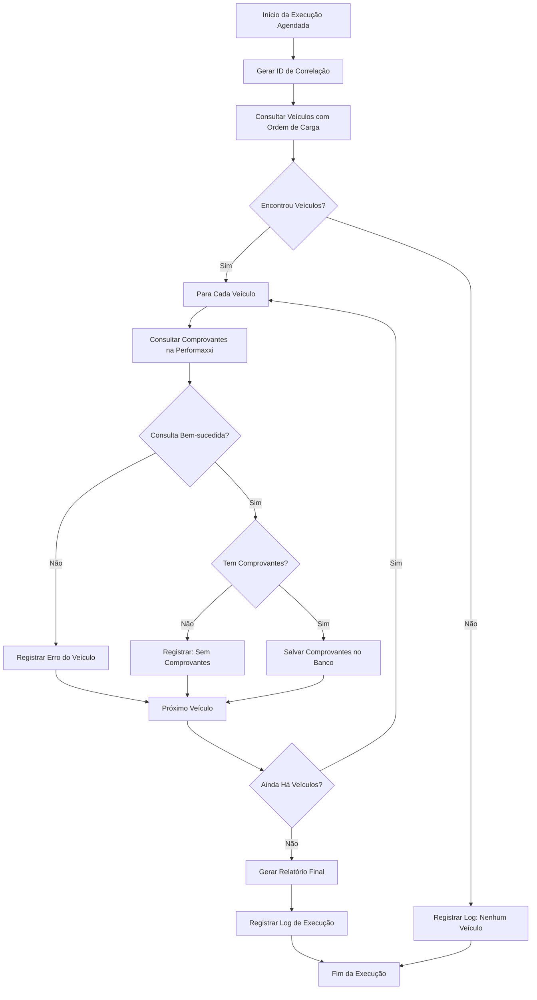
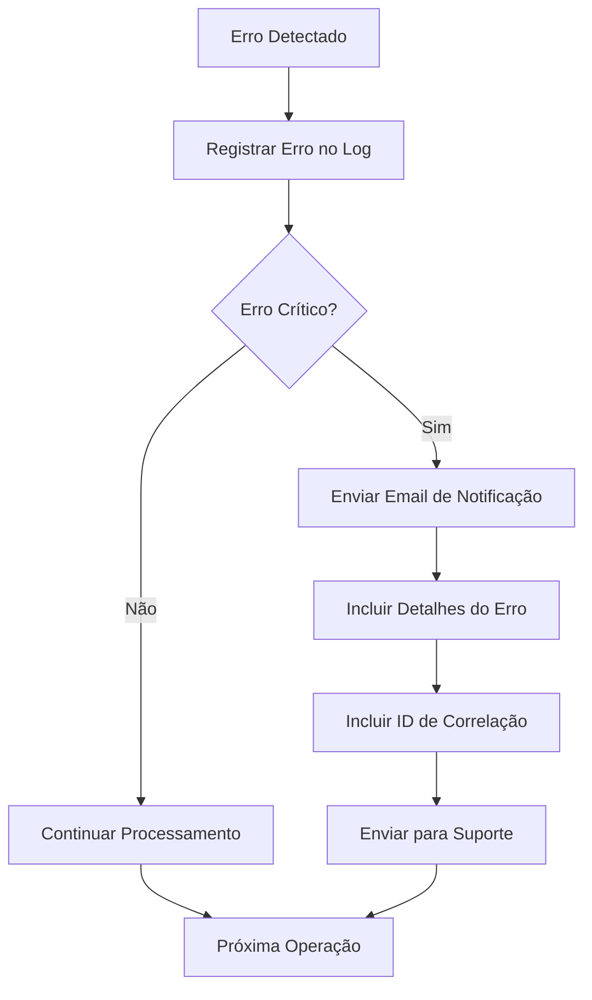

# Documentacao Funcional - Consulta Automatica de Comprovantes de Entrega

## Indice

1. [Visão Geral](#visão-geral)
2. [Objetivos do Sistema](#objetivos-do-sistema)
3. [Requisitos Funcionais](#requisitos-funcionais)
4. [Requisitos Não-Funcionais](#requisitos-não-funcionais)
5. [Regras de Negócio](#regras-de-negócio)
6. [Fluxos de Processo](#fluxos-de-processo)
7. [Casos de Uso](#casos-de-uso)
8. [Configuração do Sistema](#configuração-do-sistema)
9. [Monitoramento e Relatórios](#monitoramento-e-relatórios)
10. [Troubleshooting](#troubleshooting)

## Visão Geral

### Descrição do Sistema
O sistema de **Consulta Automática de Comprovantes de Entrega** é uma funcionalidade que busca automaticamente comprovantes de entrega na plataforma Performaxxi para veículos que possuem ordem de carga no dia atual, armazenando essas informações no sistema Sankhya para consulta e auditoria.

### Problema a Ser Resolvido
Atualmente, os comprovantes de entrega precisam ser consultados manualmente na plataforma Performaxxi, gerando:
- Perda de tempo na consulta manual
- Possibilidade de esquecimento de consultas
- Falta de histórico centralizado no sistema Sankhya
- Dificuldade de auditoria e rastreabilidade

### Benefícios Esperados
- **Automatização**: Eliminação de consultas manuais
- **Centralização**: Comprovantes disponíveis no sistema Sankhya
- **Rastreabilidade**: Histórico completo de consultas
- **Eficiência**: Processamento automático em horários programados

## Objetivos do Sistema

### Objetivo Principal
Automatizar a consulta e armazenamento de comprovantes de entrega da plataforma Performaxxi no sistema Sankhya.

### Objetivos Específicos
1. Consultar automaticamente comprovantes para veículos com ordem de carga
2. Armazenar comprovantes no banco de dados do Sankhya
3. Registrar logs de execução para auditoria
4. Notificar em caso de erros na execução

## Requisitos Funcionais

### RF01 - Consulta Automática de Veículos
**Descrição**: O sistema deve identificar automaticamente veículos que possuem ordem de carga no dia atual.

**Critérios de Aceitação**:
- Consultar apenas veículos com ordem de carga preenchida
- Considerar apenas registros do dia atual
- Processar todos os veículos encontrados

### RF02 - Consulta de Comprovantes na Performaxxi
**Descrição**: Para cada veículo identificado, o sistema deve consultar os comprovantes de entrega na plataforma Performaxxi.

**Critérios de Aceitação**:
- Consultar comprovantes por veículo individualmente
- Utilizar data, ID do rastreador, classe e conjunto como parâmetros
- Processar resposta da API Performaxxi

### RF03 - Armazenamento de Comprovantes
**Descrição**: Os comprovantes obtidos devem ser armazenados na tabela AD_COMPROVANTES.

**Critérios de Aceitação**:
- Salvar código da entrega
- Salvar identificador do cliente
- Salvar URL de acesso ao comprovante
- Registrar data e hora da execução
- Marcar status como "PROCESSADO"

### RF04 - Registro de Logs
**Descrição**: O sistema deve registrar logs detalhados de todas as execuções.

**Critérios de Aceitação**:
- Registrar início e fim da execução
- Contar total de veículos processados
- Contar total de comprovantes encontrados
- Registrar duração da execução
- Logar erros específicos por veículo

### RF05 - Notificação de Erros
**Descrição**: Em caso de erro na execução, o sistema deve enviar notificação por email.

**Critérios de Aceitação**:
- Enviar email para suporte@guaranamineiro.com.br
- Incluir detalhes do erro
- Incluir tempo de execução
- Incluir ID de correlação

## Requisitos Não-Funcionais

### RNF01 - Performance
- **Tempo de execução**: Máximo de 5 minutos por execução
- **Timeout de API**: 60 segundos por consulta
- **Processamento**: Suporte a até 100 veículos por execução

### RNF02 - Disponibilidade
- **Disponibilidade**: 99% de uptime
- **Execução**: Automática conforme cronograma configurado
- **Retry**: 3 tentativas em caso de erro

### RNF03 - Segurança
- **Autenticação**: Credenciais seguras para API Performaxxi
- **Logs**: Registro de auditoria de todas as operações
- **Permissões**: Acesso restrito a usuários autorizados

### RNF04 - Escalabilidade
- **Volume**: Suporte a crescimento de 50% no número de veículos
- **Concorrência**: Execução única por vez
- **Armazenamento**: Retenção de dados por 90 dias

## Regras de Negócio

### RN01 - Critério de Seleção de Veículos
- Apenas veículos com campo ORDEMCARGA preenchido
- Apenas registros com data de negociação igual ao dia atual
- Excluir veículos já processados com sucesso no mesmo dia

### RN02 - Formato de Dados
- Data deve estar no formato YYYY-MM-DD para API
- Classe deve ser sempre "ENTREGA"
- Conjunto deve ser sempre "COMPROVANTES"

### RN03 - Tratamento de Erros
- Erro em um veículo não deve interromper processamento dos demais
- Logs de erro devem ser registrados por veículo
- Email de notificação apenas para erros críticos

### RN04 - Retenção de Dados
- Comprovantes: Retenção mínima de 90 dias
- Logs de execução: Retenção mínima de 90 dias
- Limpeza automática de dados antigos

## Fluxos de Processo

### Fluxo Principal - Execução Automática



### Fluxo de Tratamento de Erro



## Casos de Uso

### CU01 - Execução Automática de Consulta

**Ator Principal**: Sistema (Ação Agendada)

**Pré-condições**:
- Sistema Sankhya em funcionamento
- Conexão com API Performaxxi disponível
- Tabela AD_COMPROVANTES criada

**Fluxo Principal**:
1. Sistema inicia execução no horário agendado
2. Sistema consulta veículos com ordem de carga do dia
3. Para cada veículo encontrado:
   1. Sistema consulta comprovantes na Performaxxi
   2. Sistema salva comprovantes no banco de dados
4. Sistema registra log de execução
5. Sistema finaliza execução

**Fluxo Alternativo**:
- 3a. Se erro na consulta: registrar erro e continuar próximo veículo
- 4a. Se erro crítico: enviar notificação por email

**Pós-condições**:
- Comprovantes salvos no banco de dados
- Log de execução registrado
- Notificação enviada (se houver erro crítico)

### CU02 - Consulta Manual de Comprovantes

**Ator Principal**: Usuário do Sistema

**Pré-condições**:
- Usuário autenticado no sistema
- Comprovantes já processados pelo sistema automático

**Fluxo Principal**:
1. Usuário acessa consulta de comprovantes
2. Usuário filtra por data, veículo ou cliente
3. Sistema exibe lista de comprovantes
4. Usuário seleciona comprovante desejado
5. Sistema exibe detalhes do comprovante
6. Usuário acessa URL do comprovante (se necessário)

## Configuração do Sistema

### Configuração de Agendamento

**Localização**: Administração ? Agendamento ? Ações Agendadas

**Parâmetros de Configuração**:
- **Nome**: "Comprovantes de Entrega - Performaxxi"
- **Frequência**: Diária
- **Horário**: 08:00 (configurável)
- **Timeout**: 300 segundos
- **Tentativas**: 3
- **Intervalo entre tentativas**: 5 minutos

### Configuração da API Performaxxi

**Parâmetros Necessários**:
- **URL Base**: https://www.performaxxi.com.br
- **Endpoint**: /API.REST/comprovantes-entrega
- **Autenticação**: Basic Auth
- **Timeout de Conexão**: 30 segundos
- **Timeout de Leitura**: 60 segundos

### Configuração de Notificações

**Email de Notificação**:
- **Destinatário**: suporte@guaranamineiro.com.br
- **Assunto**: "[ERRO] Comprovantes de Entrega - [ID]"
- **Formato**: HTML
- **Conteúdo**: Detalhes do erro, tempo de execução, ID de correlação

## Monitoramento e Relatórios

### Dashboard de Monitoramento

**Métricas Disponíveis**:
- Última execução realizada
- Total de veículos processados
- Total de comprovantes encontrados
- Tempo médio de execução
- Taxa de sucesso
- Status da última execução

### Relatórios Disponíveis

**Relatório Diário**:
- Resumo de execuções do dia
- Veículos processados
- Comprovantes encontrados
- Erros ocorridos

**Relatório Semanal**:
- Estatísticas de performance
- Tendências de crescimento
- Análise de erros

**Relatório Mensal**:
- Análise de qualidade
- Sugestões de melhorias
- Métricas de disponibilidade

### Consultas de Monitoramento

**Consultar Últimas Execuções**:
```sql
SELECT * FROM AD_ACAO_AGENDADA_LOG
ORDER BY DATA_EXECUCAO DESC;
```

**Consultar Comprovantes do Dia**:
```sql
SELECT * FROM AD_COMPROVANTES
WHERE DATA_ENTREGA = TO_CHAR(SYSDATE, 'YYYY-MM-DD');
```

**Consultar Estatísticas**:
```sql
SELECT STATUS, COUNT(*) AS TOTAL_EXECUCOES,
       AVG(TOTAL_COMPROVANTES) AS MEDIA_COMPROVANTES
FROM AD_ACAO_AGENDADA_LOG
WHERE DATA_EXECUCAO >= SYSDATE - 30
GROUP BY STATUS;
```

## Troubleshooting

### Problemas Comuns

**Problema 1: Nenhum Veículo Encontrado**
- **Sintoma**: Log mostra "0 veículos encontrados"
- **Causa**: Nenhum veículo com ordem de carga no dia
- **Solução**: Verificar se há vendas com ordem de carga no dia atual

**Problema 2: Erro de Conexão com API**
- **Sintoma**: Timeout ou erro de conexão
- **Causa**: API Performaxxi indisponível ou credenciais inválidas
- **Solução**: Verificar status da API e validar credenciais

**Problema 3: Erro de Permissão no Banco**
- **Sintoma**: Erro ao salvar comprovantes
- **Causa**: Usuário sem permissão na tabela AD_COMPROVANTES
- **Solução**: Conceder permissões adequadas ao usuário de execução

**Problema 4: Email de Notificação Não Enviado**
- **Sintoma**: Erro crítico ocorreu mas email não foi enviado
- **Causa**: Configuração incorreta do servidor de email
- **Solução**: Verificar configurações de SMTP no Sankhya

### Logs de Debug

**Habilitar Logs Detalhados**:
- Acessar configurações do sistema
- Ativar modo debug para módulo Performaxxi
- Verificar logs no console do Sankhya

**Informações de Log**:
- ID de correlação da execução
- Timestamp de início e fim
- Detalhes de cada veículo processado
- Mensagens de erro específicas

### Contatos de Suporte

**Suporte Técnico**:
- **Email**: suporte@guaranamineiro.com.br
- **Horário**: 08:00 às 18:00 (segunda a sexta)

**Suporte Performaxxi**:
- **Email**: suporte@performaxxi.com.br
- **Documentação**: https://www.performaxxi.com.br/API.WS.Documentation2/

**Suporte Sankhya**:
- **Email**: suporte@sankhya.com.br
- **Documentação**: https://developer.sankhya.com.br/

---

**Versão**: 1.0.0
**Última atualização**: Janeiro 2025
**Autor**: Sistema de Integração PERFORMAXXI
