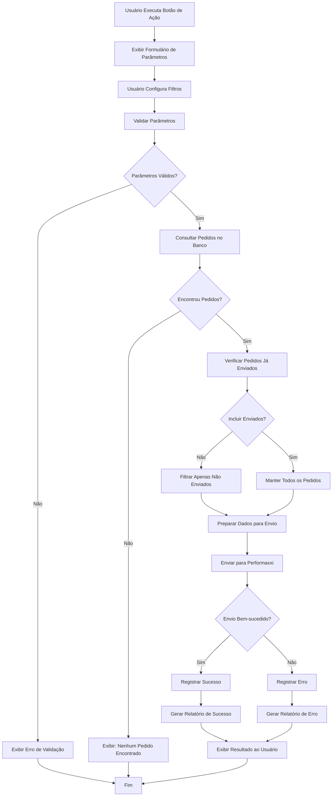

# Documentação Funcional - Integração de Pedidos com Performaxxi

## Índice

1. [Visão Geral](#visão-geral)
2. [Objetivos do Sistema](#objetivos-do-sistema)
3. [Requisitos Funcionais](#requisitos-funcionais)
4. [Requisitos Não-Funcionais](#requisitos-não-funcionais)
5. [Regras de Negócio](#regras-de-negócio)
6. [Fluxos de Processo](#fluxos-de-processo)
7. [Casos de Uso](#casos-de-uso)
8. [Configuração do Sistema](#configuração-do-sistema)
9. [Monitoramento e Relatórios](#monitoramento-e-relatórios)
10. [Troubleshooting](#troubleshooting)

## Visão Geral

### Descrição do Sistema
O sistema de **Integração de Pedidos com Performaxxi** permite o envio manual de pedidos do sistema Sankhya para a plataforma Performaxxi, otimizando rotas de entrega e melhorando a eficiência logística através da automação do processo de integração.

### Problema a Ser Resolvido
Atualmente, o processo de integração de pedidos com a Performaxxi é manual e apresenta:
- Demora no envio de pedidos para otimização de rotas
- Possibilidade de esquecimento de envios
- Falta de controle sobre quais pedidos já foram enviados
- Dificuldade de rastreamento de integrações realizadas

### Benefícios Esperados
- **Automatização**: Envio automático de pedidos para otimização
- **Flexibilidade**: Filtros configuráveis para diferentes cenários
- **Controle**: Rastreamento de pedidos já enviados
- **Eficiência**: Processamento otimizado em lotes
- **Auditoria**: Logs detalhados de todas as operações

## Objetivos do Sistema

### Objetivo Principal
Permitir o envio manual de pedidos do sistema Sankhya para a plataforma Performaxxi com controle total sobre filtros e parâmetros de integração.

### Objetivos Específicos
1. Consultar pedidos baseado em filtros configuráveis
2. Enviar pedidos selecionados para a Performaxxi
3. Registrar logs de integração para auditoria
4. Evitar envio duplicado de pedidos
5. Fornecer feedback detalhado sobre o resultado da integração

## Requisitos Funcionais

### RF01 - Consulta de Pedidos com Filtros
**Descrição**: O sistema deve permitir consultar pedidos baseado em filtros configuráveis pelo usuário.

**Critérios de Aceitação**:
- Filtrar por período (data início e fim)
- Filtrar por empresa
- Filtrar por vendedor
- Filtrar por parceiro/cliente
- Filtrar por tipo de operação
- Filtrar por ordem de carga
- Filtrar por status pendente
- Filtrar por veículo

### RF02 - Validação de Dados dos Pedidos
**Descrição**: O sistema deve validar os dados dos pedidos antes do envio para garantir integridade.

**Critérios de Aceitação**:
- Validar dados obrigatórios do cliente
- Validar informações de entrega
- Validar dados financeiros
- Exibir mensagens de erro para dados inválidos

### RF03 - Envio de Pedidos para Performaxxi
**Descrição**: O sistema deve enviar os pedidos selecionados para a plataforma Performaxxi.

**Critérios de Aceitação**:
- Enviar pedidos em formato JSON
- Incluir dados completos do cliente
- Incluir informações de entrega
- Incluir dados financeiros
- Gerar número de lote único

### RF04 - Controle de Pedidos Enviados
**Descrição**: O sistema deve controlar quais pedidos já foram enviados para evitar duplicação.

**Critérios de Aceitação**:
- Verificar pedidos já enviados na tabela de log
- Permitir reenvio através de parâmetro específico
- Registrar pedidos enviados com sucesso
- Registrar pedidos com erro

### RF05 - Registro de Logs de Integração
**Descrição**: O sistema deve registrar logs detalhados de todas as integrações realizadas.

**Critérios de Aceitação**:
- Registrar início e fim da execução
- Contar total de pedidos processados
- Contar sucessos e erros
- Registrar duração da execução
- Registrar parâmetros utilizados

### RF06 - Feedback ao Usuário
**Descrição**: O sistema deve fornecer feedback detalhado sobre o resultado da integração.

**Critérios de Aceitação**:
- Exibir total de pedidos encontrados
- Exibir total de pedidos enviados
- Exibir total de sucessos e erros
- Exibir tempo de execução
- Exibir lista de registros enviados

## Requisitos Não-Funcionais

### RNF01 - Performance
- **Tempo de execução**: Máximo de 30 segundos para até 100 pedidos
- **Timeout de API**: 60 segundos por requisição
- **Processamento**: Suporte a até 500 pedidos por execução

### RNF02 - Usabilidade
- **Interface**: Botão de ação intuitivo e fácil de usar
- **Feedback**: Mensagens claras sobre o progresso e resultado
- **Parâmetros**: Formulário simples para configuração de filtros

### RNF03 - Confiabilidade
- **Disponibilidade**: 99% de uptime
- **Retry**: 3 tentativas em caso de erro de rede
- **Validação**: Verificação rigorosa de dados antes do envio

### RNF04 - Segurança
- **Autenticação**: Credenciais seguras para API Performaxxi
- **Logs**: Registro de auditoria de todas as operações
- **Permissões**: Acesso restrito a usuários autorizados

## Regras de Negócio

### RN01 - Critério de Seleção de Pedidos
- Apenas pedidos com status "Liberado"
- Apenas pedidos de venda (TIPMOV = 'V')
- Apenas pedidos no período especificado
- Excluir pedidos já enviados (exceto se parâmetro permitir)

### RN02 - Formato de Dados
- Dados do cliente: nome, endereço, telefone, email
- Dados de entrega: endereço completo, instruções
- Dados financeiros: valor total, peso, volume
- Dados de identificação: número do pedido, data

### RN03 - Tratamento de Erros
- Erro em um pedido não deve interromper envio dos demais
- Logs de erro devem ser registrados por pedido
- Mensagem de erro clara para o usuário
- Sugestões de correção quando possível

### RN04 - Controle de Duplicação
- Verificar na tabela de log se pedido já foi enviado
- Permitir reenvio através de parâmetro "Incluir Enviados"
- Registrar todos os envios para auditoria

## Fluxos de Processo

### Fluxo Principal - Integração de Pedidos



## Casos de Uso

### CU01 - Integração Manual de Pedidos

**Ator Principal**: Usuário do Sistema

**Pré-condições**:
- Usuário autenticado no sistema
- Conexão com API Performaxxi disponível
- Pedidos existentes no período especificado

**Fluxo Principal**:
1. Usuário acessa tela de vendas
2. Usuário clica no botão "Integrar Performaxxi"
3. Sistema exibe formulário de parâmetros
4. Usuário configura filtros desejados
5. Sistema consulta pedidos baseado nos filtros
6. Sistema prepara dados para envio
7. Sistema envia pedidos para Performaxxi
8. Sistema registra resultado da integração
9. Sistema exibe relatório de resultado ao usuário

**Fluxo Alternativo**:
- 5a. Se nenhum pedido encontrado: exibir mensagem informativa
- 7a. Se erro no envio: registrar erro e exibir detalhes

**Pós-condições**:
- Pedidos enviados para Performaxxi
- Log de integração registrado
- Relatório de resultado exibido

## Configuração do Sistema

### Configuração do Botão de Ação

**Localização**: Configuração de Botões de Ação no Sankhya

**Parâmetros de Configuração**:
- **Nome**: "Integração Performaxxi"
- **Classe**: br.com.performaxxi.action.botaoAcao.IntegraPerformaxxi
- **Tabela**: TGFCAB (Cabeçalho de Vendas)
- **Permissões**: Usuários com acesso a vendas

### Parâmetros Suportados

**Parâmetros Obrigatórios**:
- **PERIODO_INI**: Data início do período (formato: DD/MM/AAAA)
- **PERIODO_FIN**: Data fim do período (formato: DD/MM/AAAA)

**Parâmetros Opcionais**:
- **P_CODEMP**: Códigos das empresas (separados por vírgula)
- **P_CODVEND**: Códigos dos vendedores (separados por vírgula)
- **P_CODPARC**: Código do parceiro/cliente
- **P_TIPO**: Tipo de operação (P = Pedido)
- **P_ORDEMCARGA**: Número da ordem de carga
- **P_PENDENTE**: Status pendente (S/N)
- **P_CODVEICULO**: Código do veículo
- **DEBUG**: Modo debug (true/false)
- **INCLUIR_ENVIADOS**: Incluir pedidos já enviados (true/false)

## Monitoramento e Relatórios

### Dashboard de Monitoramento

**Métricas Disponíveis**:
- Total de integrações realizadas
- Taxa de sucesso das integrações
- Tempo médio de execução
- Pedidos processados por dia
- Erros mais comuns

### Consultas de Monitoramento

**Consultar Últimas Integrações**:
```sql
SELECT * FROM AD_INTPERFORMAXXILOG
WHERE TIPO_REGISTRO = 'EXECUCAO'
ORDER BY DATA_INICIO DESC;
```

## Troubleshooting

### Problemas Comuns

**Problema 1: Nenhum Pedido Encontrado**
- **Sintoma**: Mensagem "Nenhum pedido encontrado para integração"
- **Causa**: Filtros muito restritivos ou período sem pedidos
- **Solução**: Verificar período de datas e ampliar critérios de busca

**Problema 2: Erro de Autenticação**
- **Sintoma**: "ERRO DE AUTENTICACAO - API PERFORMAXXI"
- **Causa**: Credenciais inválidas ou expiradas
- **Solução**: Verificar usuário e senha da API Performaxxi

**Problema 3: Timeout na API**
- **Sintoma**: Erro de timeout na comunicação
- **Causa**: API lenta ou sobrecarregada
- **Solução**: Aumentar timeout ou executar em horário de menor demanda

### Contatos de Suporte

**Suporte Técnico**:
- **Email**: suporte@guaranamineiro.com.br
- **Horário**: 08:00 às 18:00 (segunda a sexta)

**Suporte Performaxxi**:
- **Email**: suporte@performaxxi.com.br
- **Documentação**: https://www.performaxxi.com.br/API.WS.Documentation2/

---

**Versão**: 1.0.0
**Última atualização**: Janeiro 2025
**Autor**: Sistema de Integração PERFORMAXXI
