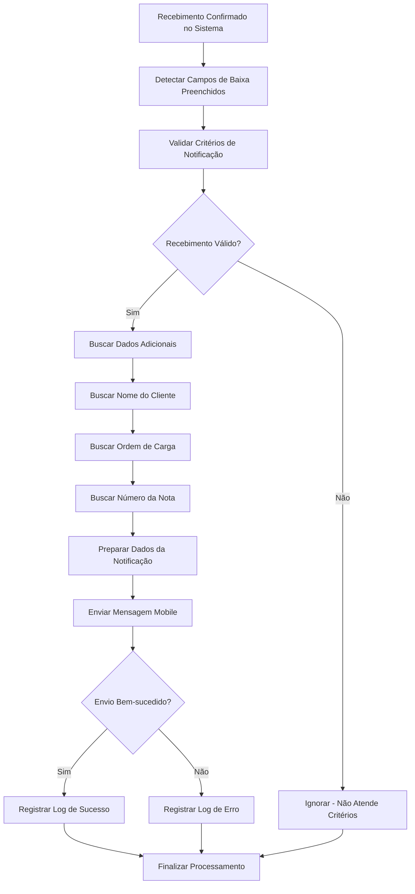
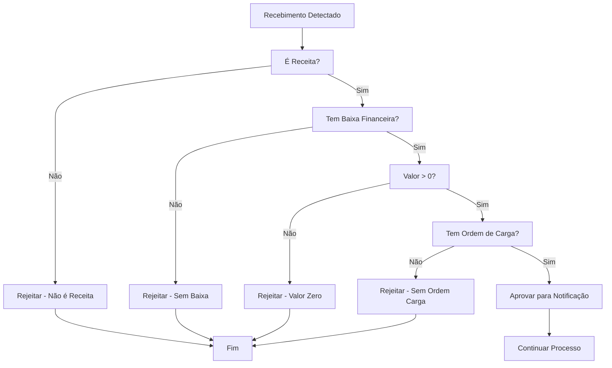

# Documentação Funcional - Notificação Automática de Recebimentos

## Índice

1. [Visão Geral](#visão-geral)
2. [Objetivos do Sistema](#objetivos-do-sistema)
3. [Requisitos Funcionais](#requisitos-funcionais)
4. [Requisitos Não-Funcionais](#requisitos-não-funcionais)
5. [Regras de Negócio](#regras-de-negócio)
6. [Fluxos de Processo](#fluxos-de-processo)
7. [Casos de Uso](#casos-de-uso)
8. [Configuração do Sistema](#configuração-do-sistema)
9. [Monitoramento e Relatórios](#monitoramento-e-relatórios)
10. [Troubleshooting](#troubleshooting)

## Visão Geral

### Descrição do Sistema
O sistema de **Notificação Automática de Recebimentos** monitora automaticamente os recebimentos de pagamentos via PIX no sistema Sankhya e notifica os motoristas através de mensagens mobile via plataforma Performaxxi, proporcionando transparência e agilidade no processo de liquidação de títulos.

### Problema a Ser Resolvido
Atualmente, quando um pagamento é confirmado via PIX, os motoristas não recebem notificação automática, gerando:
- Falta de transparência sobre confirmação de pagamentos
- Necessidade de consulta manual para verificar status
- Demora na comunicação de recebimentos
- Possível insatisfação dos motoristas

### Benefícios Esperados
- **Transparência**: Motoristas recebem confirmação imediata de pagamentos
- **Automatização**: Notificação automática sem intervenção manual
- **Agilidade**: Comunicação instantânea de recebimentos
- **Satisfação**: Melhoria na experiência do motorista
- **Rastreabilidade**: Logs detalhados de todas as notificações

## Objetivos do Sistema

### Objetivo Principal
Notificar automaticamente os motoristas sobre a confirmação de recebimentos via PIX, proporcionando transparência no processo de liquidação de títulos.

### Objetivos Específicos
1. Monitorar recebimentos de pagamentos na tabela financeira
2. Validar se o recebimento atende aos critérios de notificação
3. Enviar mensagem mobile para o motorista via Performaxxi
4. Registrar logs de todas as notificações enviadas
5. Manter histórico para auditoria e consulta

## Requisitos Funcionais

### RF01 - Monitoramento de Recebimentos
**Descrição**: O sistema deve monitorar automaticamente a tabela de recebimentos financeiros.

**Critérios de Aceitação**:
- Detectar inserção de novos recebimentos
- Detectar atualização de recebimentos existentes
- Monitorar campos específicos de baixa financeira
- Processar apenas recebimentos válidos

### RF02 - Validação de Recebimentos
**Descrição**: O sistema deve validar se o recebimento atende aos critérios para notificação.

**Critérios de Aceitação**:
- Verificar se é uma receita (não despesa)
- Verificar se possui baixa financeira válida
- Verificar se o valor é maior que zero
- Verificar se possui ordem de carga associada
- Verificar se possui dados do cliente

### RF03 - Busca de Dados Adicionais
**Descrição**: O sistema deve buscar informações complementares necessárias para a notificação.

**Critérios de Aceitação**:
- Buscar nome do cliente
- Buscar ordem de carga da nota
- Buscar número da nota fiscal
- Validar existência de celular do cliente

### RF04 - Envio de Notificação Mobile
**Descrição**: O sistema deve enviar mensagem mobile para o motorista via Performaxxi.

**Critérios de Aceitação**:
- Enviar mensagem formatada com dados do recebimento
- Incluir nome do cliente
- Incluir valor recebido
- Incluir número da nota
- Incluir ordem de carga
- Gerar ID único de correlação

### RF05 - Registro de Logs
**Descrição**: O sistema deve registrar logs detalhados de todas as notificações.

**Critérios de Aceitação**:
- Registrar dados do recebimento
- Registrar tipo de evento (INSERT/UPDATE)
- Registrar status da notificação
- Registrar mensagem de erro (se houver)
- Registrar data/hora da execução

### RF06 - Tratamento de Erros
**Descrição**: O sistema deve tratar erros de forma adequada sem interromper o fluxo principal.

**Critérios de Aceitação**:
- Continuar processamento em caso de erro
- Registrar erros específicos no log
- Não afetar transação financeira principal
- Permitir reprocessamento posterior

## Requisitos Não-Funcionais

### RNF01 - Performance
- **Tempo de processamento**: Máximo de 2 segundos por recebimento
- **Timeout de API**: 30 segundos por notificação
- **Processamento**: Tempo real (imediato após baixa)

### RNF02 - Disponibilidade
- **Disponibilidade**: 99.9% de uptime
- **Processamento**: Contínuo e automático
- **Retry**: 3 tentativas em caso de erro

### RNF03 - Confiabilidade
- **Precisão**: 100% de recebimentos válidos processados
- **Integridade**: Não afetar transações financeiras
- **Consistência**: Logs sempre registrados

### RNF04 - Segurança
- **Autenticação**: Credenciais seguras para API Performaxxi
- **Logs**: Registro de auditoria de todas as operações
- **Permissões**: Acesso restrito a dados necessários

## Regras de Negócio

### RN01 - Critério de Notificação
- Apenas receitas (RECDESP = 1)
- Apenas com baixa financeira válida
- Apenas com valor maior que zero
- Apenas com ordem de carga associada

### RN02 - Formato da Mensagem
- Mensagem personalizada com nome do cliente
- Incluir valor formatado em reais
- Incluir número da nota fiscal
- Incluir ordem de carga
- Tom cordial e profissional

### RN03 - Campos de Trigger
- CODTIPOPERBAIXA: Código do tipo de operação de baixa
- DHTIPOPERBAIXA: Data/hora do tipo de operação
- DHBAIXA: Data/hora da baixa
- VLRBAIXA: Valor da baixa (> 0)

### RN04 - Tratamento de Erros
- Erro na notificação não deve afetar a baixa financeira
- Logs de erro devem ser registrados
- Processamento deve continuar normalmente

## Fluxos de Processo

### Fluxo Principal - Notificação de Recebimento



### Fluxo de Validação



## Casos de Uso

### CU01 - Notificação Automática de Recebimento

**Ator Principal**: Sistema (Evento Programado)

**Pré-condições**:
- Recebimento confirmado no sistema financeiro
- Campos de baixa preenchidos
- Conexão com API Performaxxi disponível

**Fluxo Principal**:
1. Sistema detecta baixa de recebimento
2. Sistema valida critérios de notificação
3. Sistema busca dados adicionais do cliente
4. Sistema prepara mensagem de notificação
5. Sistema envia mensagem mobile via Performaxxi
6. Sistema registra log da notificação
7. Sistema finaliza processamento

**Fluxo Alternativo**:
- 2a. Se não atende critérios: ignorar processamento
- 5a. Se erro no envio: registrar erro e continuar

**Pós-condições**:
- Mensagem enviada para motorista
- Log de notificação registrado
- Recebimento processado normalmente

### CU02 - Consulta de Histórico de Notificações

**Ator Principal**: Usuário do Sistema

**Pré-condições**:
- Usuário autenticado no sistema
- Histórico de notificações disponível

**Fluxo Principal**:
1. Usuário acessa relatório de notificações
2. Usuário filtra por período ou cliente
3. Sistema exibe histórico de notificações
4. Usuário seleciona notificação específica
5. Sistema exibe detalhes da notificação
6. Usuário visualiza status e mensagens de erro

### CU03 - Reprocessamento de Notificação com Erro

**Ator Principal**: Usuário do Sistema

**Pré-condições**:
- Notificação com erro identificada
- Dados do recebimento ainda válidos

**Fluxo Principal**:
1. Usuário consulta notificações com erro
2. Usuário identifica problema específico
3. Usuário corrige dados necessários
4. Sistema reprocessa notificação automaticamente
5. Sistema registra novo resultado

## Configuração do Sistema

### Configuração do Evento Programado

**Localização**: Administração ? Módulo Java ? Eventos Programados

**Parâmetros de Configuração**:
- **Nome**: "Recebimento Performaxxi"
- **Classe**: br.com.performaxxi.action.evento.RecebimentoEvento
- **Tabela**: TGFFIN
- **Operações**: afterInsert, afterUpdate
- **Campos de Trigger**: CODTIPOPERBAIXA, DHTIPOPERBAIXA, DHBAIXA, VLRBAIXA

### Configuração da API Performaxxi

**Parâmetros Necessários**:
- **URL Base**: https://www.performaxxi.com.br
- **Endpoint**: /API.REST/enviar-mensagem-mobile
- **Autenticação**: Basic Auth
- **Timeout de Conexão**: 30 segundos
- **Timeout de Leitura**: 60 segundos

### Configuração de Notificações

**Formato da Mensagem**:
```
"Olá [NOME_CLIENTE]! Seu pagamento no valor de R$ [VALOR] foi confirmado.
Nota: [NUMERO_NOTA] | Ordem de Carga: [ORDEM_CARGA].
Obrigado pela preferência!"
```

**Parâmetros da Mensagem**:
- **Tipo**: PAGAMENTO_CONFIRMADO
- **Título**: Pagamento Confirmado
- **Formato**: Texto com variáveis dinâmicas

## Monitoramento e Relatórios

### Dashboard de Monitoramento

**Métricas Disponíveis**:
- Total de notificações enviadas
- Taxa de sucesso das notificações
- Tempo médio de processamento
- Notificações por dia
- Erros mais comuns

### Relatórios Disponíveis

**Relatório de Notificações**:
- Data e hora da notificação
- Dados do recebimento
- Status da notificação
- Mensagens de erro

**Relatório de Performance**:
- Estatísticas de processamento
- Tempos de resposta
- Análise de erros

### Consultas de Monitoramento

**Consultar Notificações Recentes**:
```sql
SELECT * FROM AD_RECEBIMENTOLOG
ORDER BY DHEXECUCAO DESC;
```

**Consultar Notificações com Erro**:
```sql
SELECT * FROM AD_RECEBIMENTOLOG
WHERE STATUS_PROCESSAMENTO = 'ERRO'
ORDER BY DHEXECUCAO DESC;
```

**Consultar Estatísticas**:
```sql
SELECT STATUS_PROCESSAMENTO, COUNT(*) AS TOTAL,
       SUM(VALOR_RECEBIDO) AS VALOR_TOTAL
FROM AD_RECEBIMENTOLOG
WHERE DHEXECUCAO >= SYSDATE - 30
GROUP BY STATUS_PROCESSAMENTO;
```

## Troubleshooting

### Problemas Comuns

**Problema 1: Cliente sem Celular**
- **Sintoma**: Notificação não é enviada
- **Causa**: Cliente não possui celular cadastrado
- **Solução**: Atualizar cadastro do cliente com celular válido

**Problema 2: Nota sem Ordem de Carga**
- **Sintoma**: Notificação não é processada
- **Causa**: Nota fiscal não possui ordem de carga
- **Solução**: Verificar e preencher ordem de carga na nota

**Problema 3: Erro de Autenticação API**
- **Sintoma**: HTTP 401/403 na API
- **Causa**: Credenciais inválidas ou expiradas
- **Solução**: Verificar credenciais da API Performaxxi

**Problema 4: Celular Inválido**
- **Sintoma**: API retorna erro de celular inválido
- **Causa**: Formato incorreto do celular
- **Solução**: Verificar formato (10 ou 11 dígitos)

**Problema 5: Evento Não Dispara**
- **Sintoma**: Notificação não é enviada após baixa
- **Causa**: Campos de trigger não preenchidos
- **Solução**: Verificar se todos os campos estão preenchidos

### Logs de Debug

**Habilitar Logs Detalhados**:
- Configurar propriedade de debug no sistema
- Verificar logs no console do Sankhya
- Analisar fluxo de processamento

**Informações de Debug**:
- ID de correlação da notificação
- Dados do recebimento processado
- Status da validação
- Resposta da API Performaxxi

### Contatos de Suporte

**Suporte Técnico**:
- **Email**: suporte@guaranamineiro.com.br
- **Horário**: 08:00 às 18:00 (segunda a sexta)

**Suporte Performaxxi**:
- **Email**: suporte@performaxxi.com.br
- **Documentação**: https://www.performaxxi.com.br/API.WS.Documentation2/

**Suporte Sankhya**:
- **Email**: suporte@sankhya.com.br
- **Documentação**: https://developer.sankhya.com.br/

---

**Versão**: 1.0.0
**Última atualização**: Janeiro 2025
**Autor**: Sistema de Integração PERFORMAXXI
