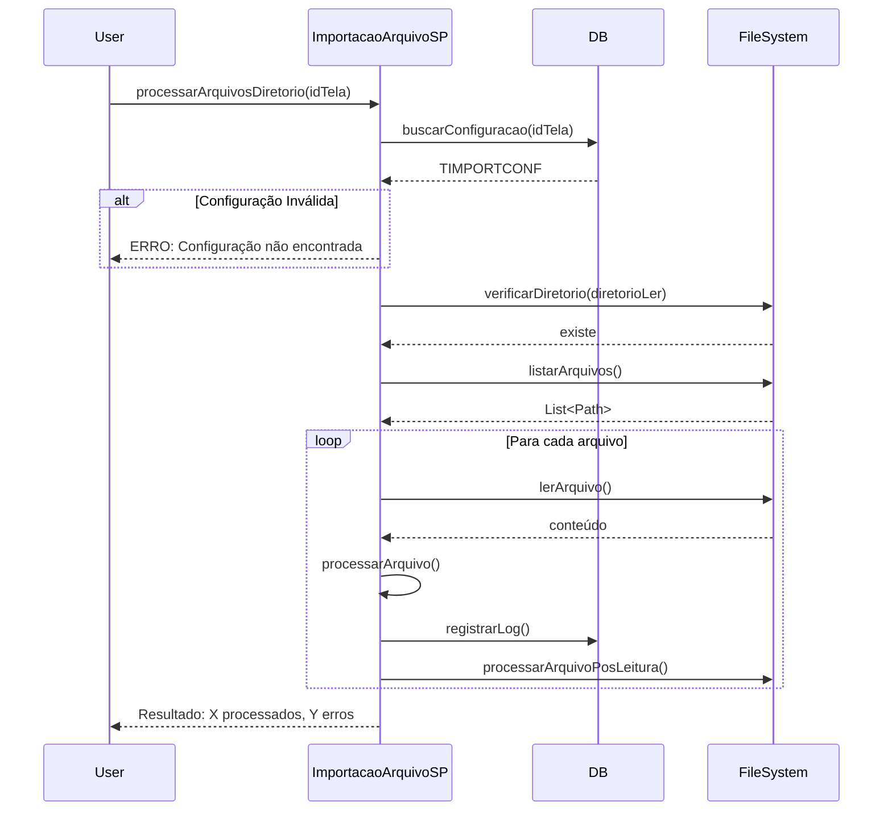
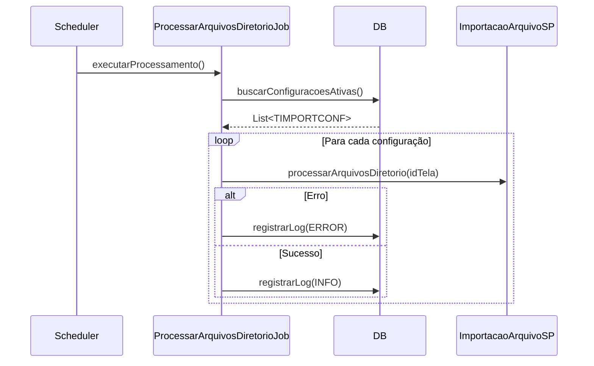

# Documentação Técnica - Extensão de Importação de Arquivos

## Índice

1. [Visão Geral da Arquitetura](#visão-geral-da-arquitetura)
2. [Componentes EJB](#componentes-ejb)
3. [Estrutura de Dados](#estrutura-de-dados)
4. [Fluxos de Processamento](#fluxos-de-processamento)
5. [APIs e Métodos](#apis-e-métodos)
6. [Integração com Sankhya](#integração-com-sankhya)
7. [Gestão de Erros](#gestão-de-erros)
8. [Performance e Otimizações](#performance-e-otimizações)

---

## Visão Geral da Arquitetura

A extensão segue o padrão arquitetural do Sankhya, utilizando EJBs (Enterprise Java Beans) para a camada de serviços e integração com o DWF (Dynamic Web Framework) para persistência.

### Stack Tecnológico

- **Java 8+**
- **EJB 3.0**
- **Sankhya Core 3.17+**
- **Apache Commons IO 2.11.0**
- **Jackson 2.13.3**

### Camadas da Aplicação

```
┌─────────────────────────────────────┐
│   Camada de Apresentação (HTML5)    │
│   Interface de Configuração         │
└──────────────┬──────────────────────┘
               │
┌──────────────▼──────────────────────┐
│   Camada de Serviços (EJBs)         │
│   - ImportacaoArquivoSP             │
│   - ProcessarArquivosDiretorioJob   │
└──────────────┬──────────────────────┘
               │
┌──────────────▼──────────────────────┐
│   Camada de Persistência (DWF)      │
│   - TIMPORTCONF                     │
│   - TIMPORTLOG                      │
└──────────────┬──────────────────────┘
               │
┌──────────────▼──────────────────────┐
│   Camada de Dados (BD)              │
│   Oracle / SQL Server               │
└─────────────────────────────────────┘
```

---

## Componentes EJB

### 1. ImportacaoArquivoSP

**Responsabilidade:** Fornecer funcionalidades de importação de arquivos sob demanda.

**Ciclo de Vida:**
- `setSessionContext()`: Inicialização
- `ejbActivate()`: Ativação da sessão
- `ejbPassivate()`: Passivação da sessão
- `ejbRemove()`: Liberação de recursos

**Dependências:**
- `EntityFacade` para acesso ao banco
- `JdbcWrapper` para execução de SQL
- Sistema de arquivos Java NIO

### 2. ProcessarArquivosDiretorioJob

**Responsabilidade:** Executar processamento automático agendado de arquivos.

**Características:**
- Stateless bean
- Execução em batch
- Logging em lote
- Tratamento isolado de erros por configuração

---

## Estrutura de Dados

### Tabela TIMPORTCONF

**Propósito:** Configurações de importação por tela

**Chave Primária:** `IDTELA`

**Regras de Negócio:**
- Campo `USAIMP` deve estar marcado para processamento
- `DIRETORIOLER` é obrigatório
- `CAMPOARQUIVO` e `CAMPONOME` são obrigatórios para processamento efetivo

**Índices Recomendados:**
```sql
CREATE INDEX IDX_TIMPORTCONF_USAIMP ON TIMPORTCONF(USAIMP);
```

### Tabela TIMPORTLOG

**Propósito:** Auditoria e rastreamento de importações

**Chave Primária:** `(IDTELA, SEQUENCIA)`

**Regras de Negócio:**
- Sequência auto-incremental por tela
- Campo MENSAGEM limitado a 4000 caracteres
- Tipos de log: INFO, ERROR, WARNING

**Índices Recomendados:**
```sql
CREATE INDEX IDX_TIMPORTLOG_IDTELA ON TIMPORTLOG(IDTELA);
CREATE INDEX IDX_TIMPORTLOG_DHIMPORTACAO ON TIMPORTLOG(DHIMPORTACAO);
```

**Política de Retenção:**
- Recomenda-se implementar rotina de purga de logs antigos
- Manter últimos 90 dias em produção

---

## Fluxos de Processamento

### Fluxo 1: Processamento Manual



### Fluxo 2: Processamento Automático (Job)



### Fluxo 3: Processamento Pós-Leitura

```
┌─────────────┐
│ Arquivo     │
│ Processado  │
└─────┬───────┘
      │
      ▼
┌─────────────────────────┐
│ Ler FAZERAPOSLER        │
└─────┬───────────────────┘
      │
      ├───► EXCLUIR ──┐
      ├───► RENOMEAR ─┼──► Fim
      └───► MOVER ────┘
```

---

## APIs e Métodos

### ImportacaoArquivoSP

#### processarArquivosDiretorio

```java
/**
 * Processa todos os arquivos de um diretório específico
 * 
 * @param idTela ID da tela de configuração
 * @return String com resultado do processamento
 */
String processarArquivosDiretorio(String idTela)
```

**Pré-condições:**
- Configuração deve existir em TIMPORTCONF
- Diretório de leitura deve existir e ser acessível

**Pós-condições:**
- Arquivos processados conforme FAZERAPOSLER
- Logs registrados em TIMPORTLOG

**Retorno:**
- Sucesso: "Processamento concluído - Arquivos processados: X, Erros: Y"
- Erro: "ERRO: [descrição do erro]"

#### validarConfiguracao

```java
/**
 * Valida se a configuração está correta
 * 
 * @param idTela ID da tela
 * @return true se válida, false caso contrário
 */
boolean validarConfiguracao(String idTela)
```

**Validações:**
1. Configuração existe
2. DIRETORIOLER não é vazio
3. CAMPOARQUIVO não é vazio
4. CAMPONOME não é vazio

#### buscarLogsImportacao

```java
/**
 * Busca logs de importação
 * 
 * @param idTela ID da tela
 * @return Logs em formato JSON
 */
String buscarLogsImportacao(String idTela)
```

**Formato de Retorno:**
```json
{
  "logs": [
    {
      "sequencia": 1,
      "mensagem": "Arquivo processado: nota.xml",
      "dataHora": "2023-06-29 10:15:30",
      "tipo": "INFO"
    }
  ]
}
```

### ProcessarArquivosDiretorioJob

#### executarProcessamento

```java
/**
 * Executa o processamento de todas as configurações ativas
 * 
 * @throws EJBException em caso de erro crítico
 */
void executarProcessamento()
```

**Características:**
- Busca todas configurações com `USAIMP = 'SIM'`
- Processa cada configuração em paralelo (isolamento de erros)
- Logs de erro não interrompem o processamento de outras configurações

---

## Integração com Sankhya

### 1. Sistema de Entidades DWF

A extensão utiliza o framework DWF para mapeamento ORM:

```xml
<!-- hnzimp-dwf.xml -->
<metadata-provider name="hnzimp-dwf" parent="mge-dwf">
    <descriptor name="ImportacaoArquivoConfig" 
                location="me/handz/importacao/dwfdata/dd/ImportacaoArquivoConfig.xml"/>
    <descriptor name="ImportacaoArquivoLog" 
                location="me/handz/importacao/dwfdata/dd/ImportacaoArquivoLog.xml"/>
</metadata-provider>
```

### 2. Parâmetros do Sistema

Registro em `TSIPAR`:
```
CHAVE: IDEXTHTML5
TEXTO: br.com.sankhya.hnzimp.cfg.configuracao.importacao
```

### 3. Acesso ao Banco de Dados

Utiliza `EntityFacadeFactory.getDWFFacade()` para acesso padronizado:

```java
EntityFacade dwfFacade = EntityFacadeFactory.getDWFFacade();
JdbcWrapper jdbc = dwfFacade.getJdbcWrapper();
NativeSql nativeSql = new NativeSql(jdbc);
```

---

## Gestão de Erros

### Tipos de Erro

1. **Erro de Configuração**
   - Configuração não encontrada
   - Campos obrigatórios ausentes
   - Retorno: Mensagem descritiva

2. **Erro de Acesso**
   - Diretório não existe
   - Permissão negada
   - Retorno: Mensagem de erro

3. **Erro de Processamento**
   - Arquivo corrompido
   - Encoding incorreto
   - Tratamento: Log de erro + continuação

4. **Erro Crítico**
   - Falha na conexão com BD
   - Exceção não tratada
   - Tratamento: EJBException

### Estratégia de Logging

```java
try {
    // Operação
    registrarLog(idTela, "Operação concluída", "INFO");
} catch (Exception e) {
    registrarLog(idTela, "Erro: " + e.getMessage(), "ERROR");
    throw new EJBException("Erro crítico", e);
}
```

**Proteção contra Loops:**
- Erros de logging não propagam exceções
- Sistema de fallback em `System.err`

---

## Performance e Otimizações

### 1. Processamento de Arquivos

**Otimizações Implementadas:**
- Buffer de leitura com Java NIO
- Processamento sequencial (evita sobrecarga de I/O)
- Transações isoladas por arquivo

**Limitações:**
- Arquivos grandes podem causar timeout
- Recomenda-se processar arquivos < 100MB

### 2. Queries ao Banco

**Índices Necessários:**
```sql
-- Oracle
CREATE INDEX IDX_TIMPORTCONF_USAIMP ON TIMPORTCONF(USAIMP);
CREATE INDEX IDX_TIMPORTLOG_IDTELA_DH ON TIMPORTLOG(IDTELA, DHIMPORTACAO);

-- SQL Server
CREATE NONCLUSTERED INDEX IDX_TIMPORTCONF_USAIMP ON TIMPORTCONF(USAIMP);
CREATE NONCLUSTERED INDEX IDX_TIMPORTLOG_IDTELA_DH ON TIMPORTLOG(IDTELA, DHIMPORTACAO);
```

**Prevenção de Deadlock:**
- Ordenação consistente em `ORDER BY`
- Uso de `NVL/NULLIF` para evitar condições de corrida

### 3. Gestão de Memória

**Estratégias:**
- Streaming de arquivos grandes
- Limpeza de recursos com `try-with-resources`
- Pool de conexões gerenciado pelo Sankhya

### 4. Recomendações de Tuning

**Para Ambientes de Alta Carga:**

1. Limitar tamanho de logs:
```sql
DELETE FROM TIMPORTLOG 
WHERE DHIMPORTACAO < SYSDATE - 90;
```

2. Particionamento de tabelas:
```sql
-- Oracle
CREATE TABLE TIMPORTLOG_PART (
  ...
) PARTITION BY RANGE (DHIMPORTACAO);
```

3. Agendamento do Job:
- Executar em horários de baixa carga
- Considerar processamento em lotes menores

---

## Segurança

### Controles Implementados

1. **Validação de Entrada**
   - Sanitização de caminhos de arquivo
   - Validação de diretórios antes de acesso

2. **Isolamento de Processamento**
   - Erros isolados por configuração
   - Sem propagação de falhas entre telas

3. **Auditoria**
   - Logs de todas as operações
   - Rastreabilidade completa

### Recomendações

1. **Permissões de Diretório**
   - Restringir acesso apenas ao usuário da aplicação
   - Usar diretórios isolados por funcionalidade

2. **Validação de Arquivos**
   - Implementar verificação de tipo MIME
   - Limitar extensões permitidas

3. **Monitoramento**
   - Alertas para falhas recorrentes
   - Dashboard de status de importações

---

## Troubleshooting Avançado

### Diagnóstico de Problemas

**1. Job não executa:**
```sql
SELECT * FROM TIMPORTCONF WHERE USAIMP = 'SIM';
```
Verificar se existem configurações ativas.

**2. Processamento lento:**
```sql
SELECT IDTELA, COUNT(*) as QTD, MAX(DHIMPORTACAO) 
FROM TIMPORTLOG 
GROUP BY IDTELA 
ORDER BY QTD DESC;
```
Identificar telas com muitos arquivos.

**3. Erros persistentes:**
```sql
SELECT * FROM TIMPORTLOG 
WHERE TIPO = 'ERROR' 
  AND DHIMPORTACAO > SYSDATE - 1
ORDER BY DHIMPORTACAO DESC;
```
Analisar padrões de erro.

### Comandos Úteis

**Purgar logs antigos:**
```sql
DELETE FROM TIMPORTLOG 
WHERE DHIMPORTACAO < SYSDATE - 90;
COMMIT;
```

**Desativar configuração:**
```sql
UPDATE TIMPORTCONF 
SET USAIMP = 'NÃO' 
WHERE IDTELA = 'TELA001';
COMMIT;
```

**Estatísticas de uso:**
```sql
SELECT 
    IDTELA,
    COUNT(*) as TOTAL_LOG,
    SUM(CASE WHEN TIPO = 'ERROR' THEN 1 ELSE 0 END) as ERROS,
    SUM(CASE WHEN TIPO = 'INFO' THEN 1 ELSE 0 END) as SUCESSOS,
    MIN(DHIMPORTACAO) as PRIMEIRA_IMPORT,
    MAX(DHIMPORTACAO) as ULTIMA_IMPORT
FROM TIMPORTLOG
GROUP BY IDTELA
ORDER BY ULTIMA_IMPORT DESC;
```

---

## Extensibilidade

### Pontos de Extensão

1. **Processamento Customizado**
   - Implementar lógica específica em `processarArquivo()`
   - Adicionar validações adicionais em `validarConfiguracao()`

2. **Novos Tipos de Arquivo**
   - Estender método `lerArquivo()` com novos parsers
   - Adicionar suporte a formatos binários

3. **Notificações**
   - Integrar com sistema de alertas
   - Implementar webhooks para eventos

### Padrões Recomendados

**Observador (Observer):**
```java
public interface ImportacaoListener {
    void onArquivoProcessado(Path arquivo, String idTela);
    void onErro(Path arquivo, Exception error);
}
```

**Estratégia (Strategy):**
```java
public interface ProcessadorArquivo {
    void processar(Path arquivo, TIMPORTCONFVO config);
}
```

---

## Referências

- Documentação Sankhya DWF
- Java EJB 3.0 Specification
- Oracle NIO2 Documentation
- Apache Commons IO Guide

---

**Versão:** 1.01  
**Última Atualização:** 2023-06-29  
**Autor:** Handz Tecnologia

