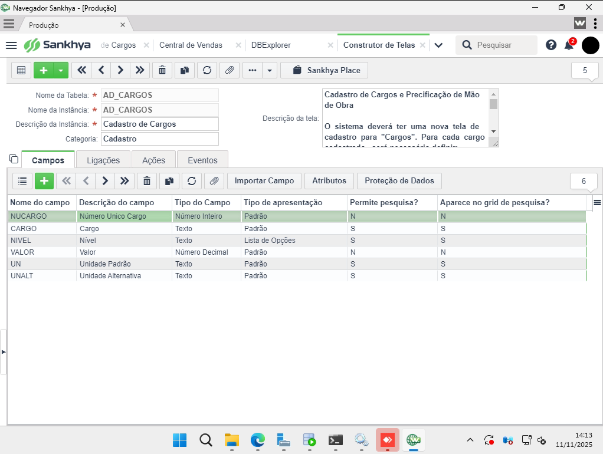
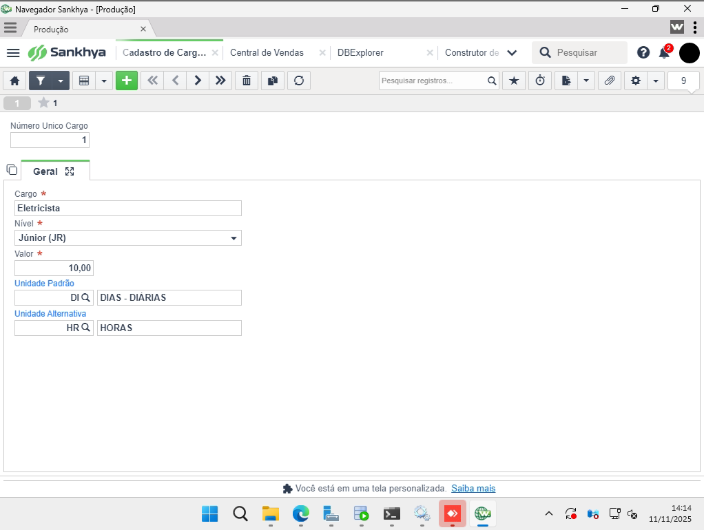
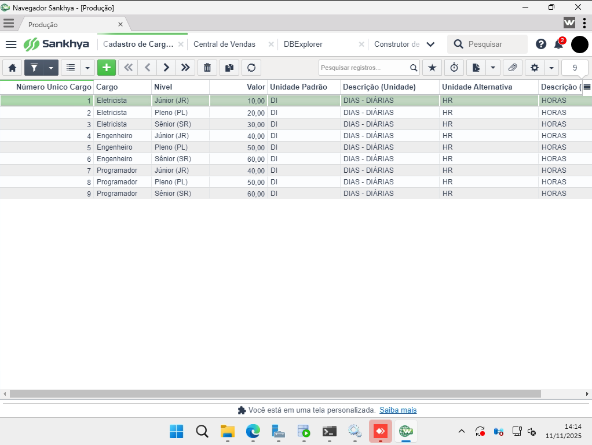
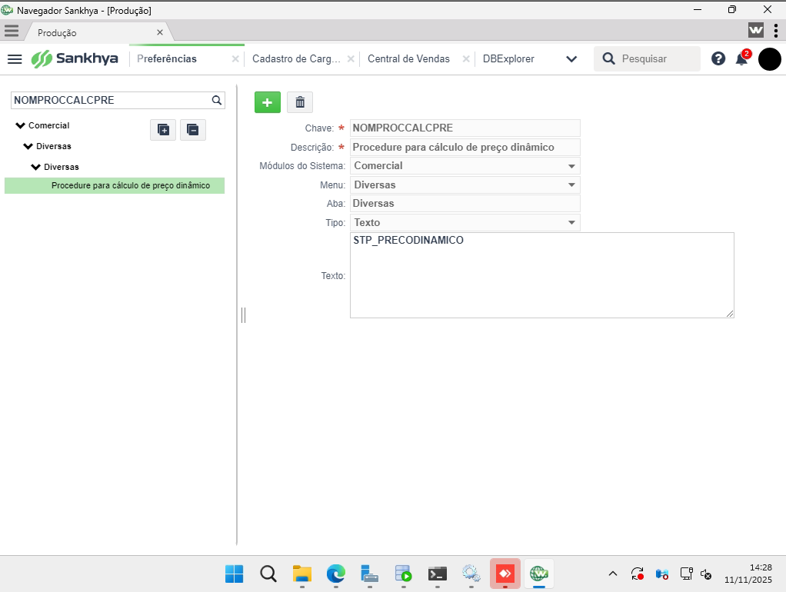

## Cadastro de Cargos e Precificação de Mão de Obra

- **Objetivo**: documentar a implementação das personalizações descritas no arquivo `P&D/docs/P&D - Pré-Escopo de personalização Orçamento docx pdf-D4Sign.pdf`, com foco no cadastro de cargos e preparação para o fluxo de orçamento.
- **Arquivos importados**:
  - Documento base: `P&D/docs/P&D - Pré-Escopo de personalização Orçamento docx pdf-D4Sign.pdf`.
  - Metadados do formulário: `P&D/docs/Metadados_AD_CARGOS.zip`.

### Estrutura da Pasta

- `P&D/` — diretório raiz do projeto de personalização.
- `P&D/docs/imagens/` — armazena as capturas de tela utilizadas na documentação.
  - `cadastro_campos.png` — estrutura dos campos da tela personalizada.
  - `cadastro_registro.png` — formulário de inclusão/edição de cargo.
  - `lista_registros.png` — grid com registros de exemplo.

### Tela Personalizada `AD_CARGOS`

- **Propósito**: manter as informações de cargos, níveis, valores e unidades, servindo como base para a precificação automática solicitada no pré-escopo.
- **Campos principais**:
  - `NUCARGO`: identificador único.
  - `CARGO`: nome do cargo.
  - `NIVEL`: nível (Júnior, Pleno, Sênior).
  - `VALOR`: valor por unidade (diária).
  - `UN`: unidade padrão (ex.: diárias).
  - `UNALT`: unidade alternativa (ex.: horas).

#### Estrutura dos Campos



- A tela personalizada contempla os campos previstos no documento, incluindo unidade padrão e alternativa.
- O campo `NIVEL` foi configurado como lista de opções para suportar os níveis JR, PL e SR.
- `VALOR` utiliza o tipo numérico decimal para suportar valores monetários.

#### Formulário de Cadastro



- Exemplo de cadastro de cargo com unidade padrão `DI (DIAS - DIÁRIAS)` e unidade alternativa `HR (HORAS)`.
- O valor atribuído (ex.: R$ 10,00) representa a diária base para o nível selecionado.
- A tela permite inserir múltiplos níveis por cargo, alinhando-se à exigência de precificação diferenciada por nível.

#### Registros de Exemplo e Integração com a Central de Vendas



- Foram cadastrados cargos de Eletricista, Engenheiro e Programador, cada um com níveis Júnior, Pleno e Sênior, incluindo valores diferenciados.
- Esses registros servem para testar:
  - Cálculo automático de diárias no orçamento com base no cargo/nível.
  - Conversão entre unidades padrão e alternativa quando necessário.
- **Central de Vendas / Central de Notas:** a descrição do item da grade agora concatena *descrição do cargo + nível* sempre que o campo `Nro cargo` estiver preenchido. Desta forma o usuário visualiza “Eletricista Júnior (JR)”, “Programador Pleno (PL)” etc. diretamente na tela de itens:


### Parâmetros de Preferência para Cálculo Dinâmico

#### `NOMPROCCALCPRE`



- A preferência `NOMPROCCALCPRE` foi configurada com o texto `STP_PRECO_DINAMICO`, garantindo que o sistema utilize a procedure personalizada para cálculo de preço dinâmico.
- O parâmetro está localizado em `Preferências > Comercial > Diversas` e deve permanecer vinculado ao módulo e menu correspondentes para que a chamada ocorra durante o processo de orçamento.
- O script da procedure está versionado em `P&D/STP_PRECO_DINAMICO.SQL`, permitindo reimplantação quando necessário.

#### `MINDIASCODPRAZO`

- **Chave**: `MINDIASCODPRAZO`
- **Descrição**: "Mínimo de dias cobrança a prazo"
- **Localização**: `Preferências > Financeiro > Diversas`
- **Tipo**: Inteiro
- **Valor Padrão**: `2`
- **Função**: Define a partir de quantos dias o sistema começa a considerar o acréscimo de 2% a cada 30 dias no cálculo do preço dinâmico.
- **Como Funciona**:
  - Se o prazo máximo da condição de pagamento (`TGFPPG`) for menor que `MINDIASCODPRAZO`, não há acréscimo por prazo.
  - Se o prazo máximo for maior ou igual a `MINDIASCODPRAZO`, o sistema calcula o acréscimo baseado na fórmula: `1 + (dias_considerados / 30) * 0.02`
  - Os dias considerados são calculados como: `prazo_maximo - (MINDIASCODPRAZO - 1)`
- **Exemplo**: 
  - Com `MINDIASCODPRAZO = 2` e prazo máximo de 90 dias:
    - Dias considerados: `90 - (2 - 1) = 89 dias`
    - Incrementos de 30 dias: `CEIL(89 / 30) = 3`
    - Fator de prazo: `1 + 3 * 0.02 = 1.06` (acréscimo de 6%)
- **Uso**: Utilizado pela procedure `STP_PRECO_DINAMICO` e pela trigger `TRG_INC_UPD_TGFITE_REGRA_PD`.
- **Observação**: Se o parâmetro não estiver cadastrado, o sistema utiliza o valor padrão de `2` dias.

#### `FATORCUSINDERET`


- **Chave**: `FATORCUSINDERET`
- **Descrição**: "Fator Custos Indiretos"
- **Localização**: `Preferências > Comercial > Preços Alternativos`
- **Tipo**: Número Decimal
- **Valor Padrão**: `0,8285`
- **Função**: Define o fator multiplicador aplicado sobre o custo base para incluir custos indiretos. Este fator compensa o custo base maior retornado pela função `OBTEMCUSTO` e alinha o cálculo do sistema com a planilha de custos.
- **Como Funciona**:
  - Quando um produto utiliza custo obtido através da função `OBTEMCUSTO`, o sistema aplica este fator sobre o custo base antes de calcular o preço final.
  - O fator é aplicado apenas para **produtos** (`USOPROD <> 'S'`) que **não utilizam preço por cargo** (`AD_PRECOCARGO <> 'S'`).
  - Fórmula: `Custo Ajustado = Custo Base × FATORCUSINDERET`
  - Após aplicar o fator, o sistema calcula o preço final usando a margem de lucro configurada.
  - **IMPORTANTE**: Este fator substitui o cálculo direto de custos indiretos, alinhando-se com a lógica da planilha de custos.
- **Exemplo**: 
  - Com `FATORCUSINDERET = 0,8285` e custo base de R$ 138,62:
    - Custo ajustado: `R$ 138,62 × 0,8285 = R$ 114,80`
    - Com margem de 30%: `Preço Final = R$ 114,80 / (1 - 0,30) = R$ 164,00`
- **Uso**: Utilizado pela procedure `STP_PRECO_DINAMICO` para ajustar o custo base de produtos antes do cálculo do preço final.
- **Observação**: 
  - O parâmetro é buscado apenas quando o item é um produto (`USOPROD <> 'S'`) que não utiliza preço por cargo (`AD_PRECOCARGO <> 'S'`).
  - Se não estiver cadastrado, o sistema utiliza o valor padrão de `0,8285`.
  - Este fator foi calculado para compensar o custo base maior retornado pela função `OBTEMCUSTO` e fazer o sistema calcular valores alinhados com a planilha de custos.
  - O valor pode ser ajustado através do parâmetro do sistema sem necessidade de alterar código.

#### `FATORMARGLUCSER`


- **Chave**: `FATORMARGLUCSER`
- **Descrição**: "Fator Margem Lucro Serviço"
- **Localização**: `Preferências > Comercial > Preços Alternativos`
- **Tipo**: Número Decimal
- **Valor Padrão**: `2,00`
- **Função**: Define o fator multiplicador aplicado ao preço base de serviços que utilizam preço por cargo (`AD_PRECOCARGO = 'S'` e `USOPROD = 'S'`).
- **Como Funciona**:
  - Quando um serviço utiliza preço por cargo, o sistema calcula o preço base a partir do valor cadastrado em `AD_CARGOS.VALOR`.
  - Este fator é então aplicado multiplicando o preço base: `Preço Final = Preço Base × FATORMARGLUCSER`
  - Após aplicar o fator, são aplicados os incrementos de prazo de pagamento e carga tributária (se houver).
  - **IMPORTANTE**: Este fator substitui a fórmula dinâmica baseada em margem para serviços com cargo, alinhando-se com a planilha de custos.
- **Exemplo**: 
  - Com `FATORMARGLUCSER = 2,00` e preço base do cargo de R$ 1.319,74:
    - Preço após fator: `R$ 1.319,74 × 2,00 = R$ 2.639,48`
    - Se houver incremento de prazo de 0% e carga tributária de 0%, o preço final será R$ 2.639,48
- **Uso**: Utilizado pela procedure `STP_PRECO_DINAMICO` e pela trigger `TRG_INC_UPD_TGFITE_REGRA_PD` para calcular o preço de serviços com cargo.
- **Observação**: 
  - O parâmetro é buscado apenas quando o item é um serviço (`USOPROD = 'S'`) que utiliza preço por cargo (`AD_PRECOCARGO = 'S'`).
  - Se não estiver cadastrado, o sistema utiliza o valor padrão de `2,00`.
  - Este fator é aplicado **antes** dos incrementos de prazo e carga tributária.
  - Para serviços que não usam cargo, a fórmula dinâmica baseada em margem continua sendo aplicada.

#### `MARGLUCROSERV`


- **Chave**: `MARGLUCROSERV`
- **Descrição**: "Margem Lucro Mínima Serviço"
- **Localização**: `Preferências > Comercial > Preços Alternativos > Diversas`
- **Tipo**: Número Decimal
- **Valor Padrão**: Configurável (exemplo: `30,00` = 30%)
- **Função**: Define a margem de lucro bruta mínima permitida para itens do tipo **serviço/mão de obra** (`USOPROD = 'S'`).
- **Como Funciona**:
  - A procedure `STP_MARGEM_LUCRO_MINIMA` verifica se a nota contém itens de serviço.
  - Se houver itens de serviço, busca o valor de `AD_MARGLUCSERV` do cabeçalho da nota (`TGFCAB`).
  - Compara `AD_MARGLUCSERV` com o valor mínimo configurado em `MARGLUCROSERV`.
  - Se `AD_MARGLUCSERV < MARGLUCROSERV`, bloqueia a nota e retorna mensagem de erro.
- **Exemplo**: 
  - Com `MARGLUCROSERV = 30,00` (30%) e margem informada na nota `AD_MARGLUCSERV = 25,00` (25%):
    - Resultado: `25 < 30` = **BLOQUEIO**
    - Mensagem: "MARGEM LUCRO BRUTA SERVIÇOS: 25 INFERIOR AO MÍNIMO CONFIGURADO: MARGLUCROSERV VALOR: 30"
- **Uso**: Utilizado pela procedure `STP_MARGEM_LUCRO_MINIMA` para validar margem mínima de serviços.
- **Observação**: 
  - O parâmetro é buscado apenas quando a nota contém itens de serviço.
  - Se não estiver cadastrado e a nota tiver itens de serviço, a procedure lança erro orientando a criação do parâmetro.
  - Permite configurar margens mínimas diferentes para serviços e produtos.

#### `MARGLUCROPROD`


- **Chave**: `MARGLUCROPROD`
- **Descrição**: "Margem Lucro Mínima Produto"
- **Localização**: `Preferências > Comercial > Preços Alternativos > Diversas`
- **Tipo**: Número Decimal
- **Valor Padrão**: Configurável (exemplo: `10,00` = 10%)
- **Função**: Define a margem de lucro bruta mínima permitida para itens do tipo **produto/material** (`USOPROD <> 'S'`).
- **Como Funciona**:
  - A procedure `STP_MARGEM_LUCRO_MINIMA` verifica se a nota contém itens de produto/material.
  - Se houver itens de produto, busca o valor de `AD_MARGLUCPROD` do cabeçalho da nota (`TGFCAB`).
  - Compara `AD_MARGLUCPROD` com o valor mínimo configurado em `MARGLUCROPROD`.
  - Se `AD_MARGLUCPROD < MARGLUCROPROD`, bloqueia a nota e retorna mensagem de erro.
- **Exemplo**: 
  - Com `MARGLUCROPROD = 10,00` (10%) e margem informada na nota `AD_MARGLUCPROD = 8,00` (8%):
    - Resultado: `8 < 10` = **BLOQUEIO**
    - Mensagem: "MARGEM LUCRO BRUTA PRODUTOS: 8 INFERIOR AO MÍNIMO CONFIGURADO: MARGLUCROPROD VALOR: 10"
- **Uso**: Utilizado pela procedure `STP_MARGEM_LUCRO_MINIMA` para validar margem mínima de produtos.
- **Observação**: 
  - O parâmetro é buscado apenas quando a nota contém itens de produto/material.
  - Se não estiver cadastrado e a nota tiver itens de produto, a procedure lança erro orientando a criação do parâmetro.
  - Permite configurar margens mínimas diferentes para serviços e produtos.
  - Se a nota tiver ambos os tipos de itens, ambas as margens são validadas com seus respectivos mínimos.

### Procedure de Preço Dinâmico (`P&D/STP_PRECO_DINAMICO.SQL`)

- **Objetivo**: Calcula o preço dinâmico de um produto ou serviço considerando múltiplos fatores de negócio (preço base, margem de lucro, prazo de pagamento e carga tributária).
- **Quando é chamada**: Durante a digitação de itens em notas fiscais ou orçamentos, quando o sistema precisa calcular automaticamente o preço de venda.
- **Fatores considerados no cálculo**:
  1. Preço base da tabela de preços (TGFTAB) ou valor do cargo cadastrado (AD_CARGOS)
  2. Custo base obtido através da função OBTEMCUSTO (para produtos sem cargo)
  3. Fator de custos indiretos (FATORCUSINDERET) - apenas para produtos sem cargo
  4. Margem de lucro bruta configurada no cabeçalho (AD_MARGLUCPROD ou AD_MARGLUCSERV)
  5. Fator de margem de lucro para serviços (FATORMARGLUCSER) - apenas para serviços com cargo
  6. Fator de prazo de pagamento (acréscimo de 2% a cada 30 dias)
  7. Carga tributária do produto (AD_CARGATRIBUTARIA)
- **Lógica de diferenciação entre produtos e serviços**:
  - **Identifica o tipo de item**: Utiliza o campo `USOPROD` da tabela `TGFPRO` para determinar o tipo:
    - Se `USOPROD = 'S'` → **SERVIÇO/Mão de obra**
    - Se `USOPROD <> 'S'` (qualquer outro valor, incluindo 'P') → **PRODUTO/Material**
  - **Aplica cálculo específico baseado no tipo**:
    - **Para SERVIÇOS com cargo** (`USOPROD = 'S'` e `AD_PRECOCARGO = 'S'`):
      - Usa fator configurável `FATORMARGLUCSER` (padrão: 2,00)
      - Fórmula: `Preço Final = Preço Base × FATORMARGLUCSER × (1 + Incremento Prazo) × (1 + Carga Tributária)`
    - **Para SERVIÇOS sem cargo** (`USOPROD = 'S'` e `AD_PRECOCARGO <> 'S'`):
      - Usa fórmula dinâmica com `AD_MARGLUCSERV` do cabeçalho da nota
      - Fórmula: `Preço Final = Preço Base / (1 - (Margem Total / 100))`
    - **Para PRODUTOS sem cargo** (`USOPROD <> 'S'` e `AD_PRECOCARGO <> 'S'`):
      - Obtém custo base através da função `OBTEMCUSTO`
      - Aplica fator de custos indiretos `FATORCUSINDERET` sobre o custo base
      - Usa fórmula dinâmica com `AD_MARGLUCPROD` do cabeçalho da nota
      - Fórmula: `Preço Final = (Custo Base × FATORCUSINDERET) / (1 - (Margem Total / 100))`
    - **Para PRODUTOS com cargo** (`USOPROD <> 'S'` e `AD_PRECOCARGO = 'S'`):
      - Usa preço do cargo (não aplica FATORCUSINDERET)
      - Usa fórmula dinâmica com `AD_MARGLUCPROD` do cabeçalho da nota
      - Fórmula: `Preço Final = Preço Base / (1 - (Margem Total / 100))`
  - **Fórmula de cálculo para produtos sem cargo**: 
    ```
    Preço Final = (Custo Base × FATORCUSINDERET) / (1 - (Margem Total / 100))
    Onde:
      Custo Base = Obtido através da função OBTEMCUSTO
      FATORCUSINDERET = Fator de custos indiretos (padrão: 0,8285)
      Margem Total = Margem Produto + Carga Tributária
      IMPORTANTE: Incremento de prazo NÃO é incluído aqui, será aplicado no total da nota (VLRNOTA)
    ```
  - **Fórmula de cálculo para produtos com cargo e serviços sem cargo**: 
    ```
    Preço Final = Preço Base / (1 - (Margem Total / 100))
    Onde:
      Preço Base = Preço do cargo ou preço da tabela
      Margem Total = Margem (Produto/Serviço) + Carga Tributária
      IMPORTANTE: Incremento de prazo NÃO é incluído aqui, será aplicado no total da nota (VLRNOTA)
    ```
  - **Fórmula de cálculo para serviços com cargo**:
    ```
    Preço Final = Preço Base × FATORMARGLUCSER × (1 + Carga Tributária / 100)
    Onde:
      Preço Base = Valor do cargo (AD_CARGOS.VALOR) ou preço alternativo calculado
      FATORMARGLUCSER = Fator configurável (padrão: 2,00)
      IMPORTANTE: Incremento de prazo NÃO é incluído aqui, será aplicado no total da nota (VLRNOTA)
    ```
  - **Incremento de Prazo de Pagamento**:
    - O incremento de prazo (2% a cada 30 dias) **NÃO é aplicado nos itens individuais**.
    - É aplicado **apenas no total final da nota** (`TGFCAB.VLRNOTA`) pela trigger `TRG_INC_UPD_TGFITE_REGRA_PD`.
    - Fórmula do incremento: `VLRNOTA = Soma dos Itens × (1 + Incremento Prazo / 100)`
    - Onde: `Incremento Prazo = CEIL((Prazo Máximo - (MINDIASCODPRAZO - 1)) / 30) × 2`
    - Isso garante que o incremento seja aplicado sobre o total (Serviços + Materiais), conforme a planilha de custos.
- **Fluxo de execução**:
  1. Obtém dados do formulário através da sessão (P_IDSESSAO)
  2. Busca preço base na tabela de preços vigente
  3. Verifica se produto usa preço por cargo e ajusta se necessário
  4. Obtém o custo base através da função OBTEMCUSTO (para produtos sem cargo)
  5. Obtém o fator de custos indiretos (FATORCUSINDERET) do parâmetro do sistema
  6. Obtém margens de lucro do cabeçalho da nota (AD_MARGLUCPROD e AD_MARGLUCSERV)
  7. Obtém o fator de margem de lucro para serviços (FATORMARGLUCSER) do parâmetro do sistema
  8. Identifica o tipo do item através de USOPROD
  9. Aplica o fator de custos indiretos (se produto sem cargo) ou seleciona a margem/fator conforme o tipo
  10. Calcula fator de ajuste por prazo de pagamento (retornado no JSON, mas não aplicado no preço do item)
  11. Aplica todas as margens (sem incremento de prazo) e retorna preço final em formato JSON
  12. **IMPORTANTE**: O incremento de prazo é calculado e retornado no JSON (`FATOR_PRAZO`), mas **não é aplicado no preço do item**. Ele será aplicado no total da nota (VLRNOTA) pelas triggers.
- **Retorno**: JSON com o preço calculado e fator de prazo
  ```json
  {
    "PRECO": "150.50",
    "FATOR_PRAZO": "1.06"
  }
  ```
- A procedure `STP_PRECO_DINAMICO.SQL` foi criada para calcular o preço dos itens conforme o pré-escopo:
  - Prioriza valores cadastrados em `AD_CARGOS`, usando a diária/nível como base.
  - Quando não há cargo, utiliza o preço obtido via `STP_OBTEM_PRECO2` a partir da tabela vigente.
  - **Identifica o tipo de item**: Utiliza o campo `USOPROD` da tabela `TGFPRO` para determinar se é produto (`'P'`) ou serviço (`'S'`).
  - **Aplica margem específica**: Utiliza `AD_MARGLUCPROD` para produtos e `AD_MARGLUCSERV` para serviços, ambos do cabeçalho da nota (`TGFCAB`).
  - Aplica o acréscimo de 2% a cada 30 dias com base no maior prazo configurado na condição de pagamento (`TGFPPG`).
- **Validação recente**: para um cargo com valor base de R$ 15,38 e condição de pagamento com prazo máximo de 90 dias, a procedure retornou R$ 16,30. O ajuste corresponde ao fator `1 + (90/30)*0,02 = 1,06`, confirmando o acréscimo de 6% previsto para prazos prolongados.
- Arquivo disponível em `P&D/STP_PRECO_DINAMICO.SQL`.

### Próximos Passos Recomendados

- **Fluxo de Orçamento**: validar se a seleção de modalidade e o lançamento de mão de obra consomem os dados do cadastro dos cargos.
- **Impostos e Percentuais**: implementar/confirmar regras de separação de materiais e serviços, especialmente para Empreitada Global (item 6.1 do pré-escopo).
- **Conversão para Pedido de Venda**: garantir a consolidação dos itens de serviço em um único item no pedido, com percentuais exibidos conforme exigido.

### Metadados Exportados

- **Arquivo**: `P&D/docs/Metadados_AD_CARGOS.zip`
- **Descrição**: Arquivo contendo os metadados completos da tela personalizada `AD_CARGOS`, exportado diretamente do Navegador Sankhya.
- **Conteúdo**: O arquivo ZIP contém todas as configurações da tela, incluindo:
  - Estrutura de campos e propriedades
  - Configurações de validação
  - Layouts e formatações
  - Relacionamentos e dependências
  - Configurações de permissões (se aplicável)
- **Uso**: Este arquivo permite recriar a tela `AD_CARGOS` em qualquer ambiente Sankhya sem necessidade de reconfiguração manual.
- **Como importar em outro ambiente**:
  1. Abra o **Navegador Sankhya** e acesse `Construtor de Telas`.
  2. Utilize a opção `Importar` (geralmente no menu de ações ou botão de importação).
  3. Selecione o arquivo `Metadados_AD_CARGOS.zip` do diretório `P&D/docs/`.
  4. Siga o assistente de importação para restaurar a tela com todos os campos e configurações.
  5. Verifique se a tela foi criada corretamente acessando `AD_CARGOS` no sistema.
- **Importante**:
  - O arquivo deve ser mantido versionado junto à documentação para facilitar reinstalações ou migrações.
  - Sempre que houver alterações significativas na tela `AD_CARGOS`, o arquivo deve ser reexportado e atualizado no repositório.
  - Antes de importar em ambiente de produção, recomenda-se testar em ambiente de homologação.
  - Verifique se há dependências de outras telas ou objetos que precisam ser criados antes da importação.

## Apuração de Margens na Central de Notas (`P&D/STP_MARGEM_LUCRO_MINIMA.SQL`)

As diretrizes reforçadas no e-mail *“Personalizações P&D - GP Alano e Natyeli”* foram endereçadas com os artefatos abaixo:

- **Campos AD em `TGFCAB`**: criados para exibir margem mínima, margem informada e composição percentual de mão de obra/material (conforme screenshots anexadas ao e-mail). Os campos principais são:
  - `AD_COMPOSICAO`: Destaca no cabeçalho o texto “Composição: X% mão de obra e Y% material”, como mostrado abaixo:
  - `AD_MARGLUCPROD`: **Margem de Lucro Produtos** - Margem de lucro aplicada sobre itens do tipo produto/material.
  - `AD_MARGLUCSERV`: **Margem de Lucro Serviços** - Margem de lucro aplicada sobre itens do tipo serviço/mão de obra.


- **Procedure `STP_MARGEM_LUCRO_MINIMA.SQL`**:
  - Verifica os itens da nota para identificar se há serviços (`USOPROD = 'S'`) e/ou produtos (`USOPROD <> 'S'`).
  - Lê os parâmetros `MARGLUCROSERV` e `MARGLUCROPROD` (Preferências > Comercial > Preços Alternativos > Diversas) conforme necessário.
  - Compara cada margem com seu respectivo mínimo:
    - Se a nota tem itens de serviço → valida `AD_MARGLUCSERV` contra `MARGLUCROSERV`
    - Se a nota tem itens de produto → valida `AD_MARGLUCPROD` contra `MARGLUCROPROD`
    - Se tem ambos os tipos → valida ambas as margens com seus respectivos mínimos
  - Retorna `P_SUCESSO = 'N'` e mensagem detalhada quando alguma margem estiver abaixo do mínimo, permitindo que a regra de liberação bloqueie o orçamento/nota.
  - `P_CODUSULIB` permanece reservado para evoluções de workflow, mas já é inicializado em zero.
- **Parâmetros flexíveis**: basta ajustar `MARGLUCROSERV` e/ou `MARGLUCROPROD` para alterar os limites mínimos sem necessidade de recompilar código.
- **Como usar**: invoque a procedure como validação da Central de Notas/Orçamento e use `P_MENSAGEM` para orientar o vendedor (vide imagens do e-mail "Apuração de margens de lucro").
- **Regra de Negócio / Liberação**:
  - Criado o evento “Liberação Margem Lucro Minima Bruta” (cód. 1000) em *Eventos p/ Liberação de Regras de Negócio*.
  - Esse evento deve chamar a procedure `STP_MARGEM_LUCRO_MINIMA` no momento da aprovação/confirmar orçamento.
  - Se `P_SUCESSO = 'N'`, bloqueia o processo e aciona o fluxo de liberação para o usuário autorizado (mantendo o histórico no módulo de liberação).
  - Regra configurada em **Central de Vendas > Regras de Negócio**:
    - Tipo de expressão: `Stored Procedure`
    - Onde: `Portais`
    - Quando: `Inclusão/Alteração Cabeçalho`
    - Evento de Liberação: `1000 - Liberação Margem Lucro Mínima`
    - Nome da rotina: `STP_MARGEM_LUCRO_MINIMA`


## Configuração da TOP para Agrupamento (NFSe Empreitada Global)

Para que a nota de serviço consolide todos os itens do pedido em um único serviço, foram adicionados estes campos personalizados em `TGFTOP` (capturas disponíveis no e-mail citado):


| Campo | Descrição | Utilização |
|-------|-----------|------------|
| `AD_AGRUPATDITENS` (checkbox) | “Agrupa todos os itens” | Define se a operação gera nota consolidada. |
| `AD_SERVEMPREITADA` (inteiro) | “Prestação de serviços por empreitada global” | Guarda o `CODPROD` do item agregador lançado na nota de destino. |

Somente quando ambos estiverem preenchidos (`AD_AGRUPATDITENS = 'S'` e código válido em `AD_SERVEMPREITADA`) a regra de agrupamento é executada.

### Trigger `TRG_INC_UPD_TGFITE_REGRA_PD.SQL` (`P&D/TRG_INC_UPD_TGFITE_REGRA_PD.SQL`)

- **Objetivo**: Implementa regras de validação e cálculo automático de preços para produtos que utilizam preço por cargo, além de processar produtos sem cargo aplicando o fator de custos indiretos. Também aplica o incremento de prazo no total da nota (VLRNOTA).
- **Quando executa**: **COMPOUND TRIGGER** com `BEFORE EACH ROW` e `AFTER STATEMENT` em `TGFITE`.
- **Estrutura**:
  - **BEFORE EACH ROW**: Calcula preços dos itens individualmente antes de inserir/atualizar.
  - **AFTER STATEMENT**: Aplica incremento de prazo no total da nota (VLRNOTA) após todos os itens serem processados.
- **Condições de execução**:
  - **Para produtos com preço por cargo** (`AD_PRECOCARGO = 'S'`): Aplica validações e cálculos específicos.
  - **Para produtos sem preço por cargo** (`AD_PRECOCARGO <> 'S'` e `USOPROD <> 'S'`): Aplica fator de custos indiretos (FATORCUSINDERET) e calcula preço usando margem.
- **Regras de validação aplicadas** (apenas para produtos com `AD_PRECOCARGO = 'S'`):
  - Se o tipo de operação usa "Preço de Venda" (`USARPRECOCUSTO = 'N'`), o campo `AD_NUCARGO` passa a ser obrigatório.
  - Garante que a unidade informada no item corresponde à unidade padrão do cargo (HR) ou unidade alternativa cadastrada.
  - Caso o usuário utilize a unidade alternativa, a trigger converte a quantidade seguindo `DIVMULT` + `QTDHORAS`.
  - Ajusta `CODVOL` para a unidade padrão do cargo e impede gravação quando não houver unidade alternativa configurada.
  - Ajusta quantidade automaticamente para itens com unidade DI (dias) usando o valor de `AD_DIASTRAB` do cabeçalho.
- **Lógica de diferenciação entre produtos e serviços**:
  - **Identifica o tipo de item**: Busca o campo `USOPROD` da tabela `TGFPRO` para determinar o tipo:
    - Se `USOPROD = 'S'` → **SERVIÇO/Mão de obra**
    - Se `USOPROD <> 'S'` (qualquer outro valor) → **PRODUTO/Material**
  - **Aplica cálculo específico baseado no tipo**:
    - **Para SERVIÇOS com cargo** (`USOPROD = 'S'` e `AD_PRECOCARGO = 'S'`):
      - Usa fator configurável `FATORMARGLUCSER` (padrão: 2,00) obtido do parâmetro do sistema
      - Fórmula: `Preço Final = Preço Base × FATORMARGLUCSER × (1 + Carga Tributária / 100)`
      - **IMPORTANTE**: O incremento de prazo NÃO é aplicado aqui, apenas no total da nota (VLRNOTA)
    - **Para SERVIÇOS sem cargo** (`USOPROD = 'S'` e `AD_PRECOCARGO <> 'S'`):
      - Usa fórmula dinâmica com `AD_MARGLUCSERV` do cabeçalho da nota
      - Fórmula: `Preço Final = Preço Base / (1 - (Margem Total / 100))`
    - **Para PRODUTOS com cargo** (`USOPROD <> 'S'` e `AD_PRECOCARGO = 'S'`):
      - Usa `AD_MARGLUCPROD` do cabeçalho da nota
      - Fórmula: `Preço Final = Preço Base / (1 - (Margem Total / 100))`
    - **Para PRODUTOS sem cargo** (`USOPROD <> 'S'` e `AD_PRECOCARGO <> 'S'`):
      - Obtém custo base através da função `OBTEMCUSTO`
      - Aplica fator de custos indiretos `FATORCUSINDERET` sobre o custo base
      - Usa fórmula dinâmica com `AD_MARGLUCPROD` do cabeçalho da nota
      - Fórmula: `Preço Final = (Custo Base × FATORCUSINDERET) / (1 - (Margem Total / 100))`
  - **Cálculo do preço final para produtos com cargo**:
    ```
    Preço Final = Preço Base / (1 - (Margem Total / 100))
    Onde:
      Preço Base = Preço do cargo (HR) ou preço alternativo (outras unidades)
      Margem Total = Margem Produto + Carga Tributária
      IMPORTANTE: Incremento de prazo NÃO é incluído aqui
    ```
  - **Cálculo do preço final para produtos sem cargo**:
    ```
    Preço Final = (Custo Base × FATORCUSINDERET) / (1 - (Margem Total / 100))
    Onde:
      Custo Base = Obtido através da função OBTEMCUSTO
      FATORCUSINDERET = Fator de custos indiretos (padrão: 0,8285)
      Margem Total = Margem Produto + Carga Tributária
      IMPORTANTE: Incremento de prazo NÃO é incluído aqui
    ```
  - **Cálculo do preço final para serviços com cargo**:
    ```
    Preço Final = Preço Base × FATORMARGLUCSER × (1 + Carga Tributária / 100)
    Onde:
      Preço Base = Preço do cargo (HR) ou preço alternativo (outras unidades)
      FATORMARGLUCSER = Fator configurável (padrão: 2,00)
      IMPORTANTE: Incremento de prazo NÃO é incluído aqui
    ```
- **Cálculo de VLRTOT conforme fórmula da planilha**:
  - **Para PRODUTOS**: `VLRTOT = ((VLRUNIT × QTDNEG) - VLRDESC) × (1 + AD_CARGATRIBUTARIA / 100)`
    - A carga tributária é aplicada **APÓS** subtrair o desconto
    - O desconto (`VLRDESC`) é sempre subtraído antes de aplicar outros fatores
  - **Para SERVIÇOS**: `VLRTOT = ((VLRUNIT × QTDNEG) - VLRDESC) + VALOR_TGFDIN`
    - O valor de `TGFDIN` é somado ao subtotal (após desconto)
    - O desconto (`VLRDESC`) é sempre subtraído antes de somar o TGFDIN
- **Funcionalidades**:
  - Calcula o acréscimo por prazo de pagamento (2% a cada 30 dias) usando o parâmetro `MINDIASCODPRAZO`, mas aplica apenas no total da nota (VLRNOTA) no `AFTER STATEMENT`.
  - Obtém o fator de margem de lucro para serviços (`FATORMARGLUCSER`) do parâmetro do sistema.
  - Obtém o fator de custos indiretos (`FATORCUSINDERET`) do parâmetro do sistema para produtos sem cargo.
  - Aplica a margem correta ou o fator conforme o tipo, junto com a carga tributária (sem incremento de prazo no item).
  - Ajusta automaticamente `:NEW.VLRUNIT` e `:NEW.VLRTOT` com os valores calculados conforme fórmula da planilha.
  - No `AFTER STATEMENT`, atualiza `TGFCAB.VLRNOTA` com a soma direta dos `VLRTOT` dos itens (sem incremento de prazo, conforme planilha).
  - Bloqueia a operação com mensagem de erro se validações falharem.
- **Observação**: Usa `Fpodevalidar('TGFITE')` para verificar se deve validar (retorna FALSE durante sincronização de dados).
- **Correções aplicadas**:
  - O cálculo de `VLRTOT` foi ajustado para seguir exatamente a fórmula da planilha de custos
  - Para produtos sem cargo que não conseguem obter custo base, a carga tributária é aplicada mesmo assim se o item já tiver `VLRUNIT` definido
  - O incremento de prazo foi removido do `AFTER STATEMENT` para alinhar com a planilha (VLRNOTA = soma direta dos itens)

### Trigger `TRG_INC_UPD_TGFCAB_REGRA_PD.SQL` (`P&D/TRG_INC_UPD_TGFCAB_REGRA_PD.SQL`) - **DEPRECADA**

> ⚠️ **ATENÇÃO**: Esta trigger foi substituída pelo botão de ação Java `ConsolidarItensNota` que é executado via botão de ação. Ver seção "Botão de Ação de Consolidação de Itens de Nota" abaixo para mais detalhes.

- **Objetivo**: Consolida múltiplos itens de uma nota de origem em um único item de serviço na nota de destino, aplicando margens diferenciadas para mão de obra e material.
- **Quando executa**: **AFTER INSERT OR UPDATE** em `TGFCAB` (após inserir/atualizar o cabeçalho da nota).
- **Tipo**: COMPOUND TRIGGER (processa múltiplas linhas de forma eficiente).
- **Estrutura**:
  - **AFTER EACH ROW**: Coleta NUNOTAs únicas que foram inseridas/atualizadas.
  - **AFTER STATEMENT**: Processa agrupamento de itens chamando `PROCESSAR_NUNOTA`.
- **Condição de execução para agrupamento**: Apenas quando a TOP está configurada para agrupar itens:
  - `AD_AGRUPATDITENS = 'S'` (flag de agrupamento ativado)
  - `AD_SERVEMPREITADA` preenchido (código do produto de serviço consolidado)
- **Lógica de diferenciação entre produtos e serviços**:
  - **Identifica o tipo de cada item**: Utiliza o campo `USOPROD` da tabela `TGFPRO` para classificar os itens:
    - Se `USOPROD = 'S'` → **SERVIÇO/Mão de obra** → soma em `V_TOTAL_MAO_OBRA`
    - Se `USOPROD <> 'S'` (qualquer outro valor) → **PRODUTO/Material** → soma em `V_TOTAL_MATERIAL`
  - **Aplica margens específicas no cálculo do total proporcional**:
    - Sobre o total de **mão de obra** (`V_TOTAL_MAO_OBRA`) → aplica `AD_MARGLUCSERV`
    - Sobre o total de **material** (`V_TOTAL_MATERIAL`) → aplica `AD_MARGLUCPROD`
  - **Fórmula de cálculo**:
    ```
    Total Proporcional = Total Geral + 
                         (Total Mão de Obra * AD_MARGLUCSERV / 100) + 
                         (Total Material * AD_MARGLUCPROD / 100) + 
                         Total Despesas
    ```
- **Passo a passo da consolidação**:
  1. Localiza a nota/pedido de origem via `TGFVAR` antes de limpar os vínculos.
  2. Soma todos os itens da nota de destino diferenciando por tipo:
     - Itens com `USOPROD = 'S'` → contabilizados como mão de obra
     - Itens com `USOPROD <> 'S'` → contabilizados como material
  3. Remove todos os itens existentes da nota de destino.
  4. Insere apenas um item consolidado com quantidade 1 e valor total proporcional (`CODPROD` obtido de `AD_SERVEMPREITADA`).
  5. Calcula os percentuais de mão de obra/material:
     - Percentual Mão de Obra = (Total Mão de Obra / Total Geral) * 100
     - Percentual Material = 100 - Percentual Mão de Obra
  6. Gera o texto de composição: `"Composição: X% mão de obra e Y% material"`.
     - O texto é concatenado na `OBSERVACAO` do item consolidado.
     - Também é gravado em `TGFCAB.AD_COMPOSICAO` e acrescentado à `OBSERVACAO` do cabeçalho.
  7. Atualiza o valor da nota (`VLRNOTA`) com o total proporcional calculado.
  8. Recria `TGFVAR` com a sequência 1 -> 1 e marca o documento de origem (`TGFCAB` e `TGFITE`) como não pendente.
- **Observação importante**: 
  - Todos os itens da nota destino são **REMOVIDOS** e substituídos por 1 item único. Esta trigger deve rodar **APÓS** qualquer trigger/processo que dependa da estrutura original dos itens.
  - O incremento de prazo foi removido do `AFTER STATEMENT` para alinhar com a planilha de custos (VLRNOTA = soma direta dos itens).

> **Imagens**: utilize as capturas anexadas ao e-mail (campos destacados no construtor, grid de itens agrupados etc.) para enriquecer a documentação visual salva em `P&D/imagens/`.

### Botão de Ação de Consolidação de Itens de Nota (`P&D/src/br/com/pd/action/botaoAcao/ConsolidarItensNota.java`)

- **Objetivo**: Substitui a trigger `TRG_INC_UPD_TGFCAB_REGRA_PD` e consolida múltiplos itens de uma nota de origem em um único item de serviço em uma nova nota de destino, aplicando margens diferenciadas para mão de obra e material. Executada via botão de ação para proporcionar controle manual e feedback ao usuário.
- **Tipo**: Botão de Ação Java - Rotina Java
- **Arquivo**: `P&D/src/br/com/pd/action/botaoAcao/ConsolidarItensNota.java`
- **Quando é chamada**: Executada manualmente pelo usuário através de botão de ação na tela de TGFCAB (Notas Fiscais/Negociações).

#### 🔄 Migração da Trigger para Botão de Ação

**Motivos da Migração:**
- ✅ **Controle manual**: Execução sob demanda pelo usuário
- ✅ **Flexibilidade**: Possibilidade de validar antes de executar
- ✅ **Transparência**: Feedback imediato ao usuário sobre o processamento
- ✅ **Manutenibilidade**: Mais fácil de debugar e ajustar

**⚠️ IMPORTANTE**: Antes de configurar o botão de ação, é **ESSENCIAL** remover a trigger antiga:

```sql
DROP TRIGGER "SANKHYA"."TRG_INC_UPD_TGFCAB_REGRA_PD";
```

**Razão**: A trigger executava automaticamente em INSERT/UPDATE, o que pode causar conflitos com a execução manual via botão de ação.

#### 🔧 Configuração do Botão de Ação

**Passo 1: Compilar o Projeto Java**

1. **Pré-requisitos**:
   - Java JDK 8
   - Maven 3.6+
   - JARs Sankhya na pasta `lib/` (ver `P&D/README.md` para lista completa)

2. **Compilar o projeto**:
   ```bash
   cd P&D
   mvn clean package
   ```

3. **O JAR será gerado em**: `target/consolidar-itens-nota-1.0.0.jar`

**Passo 2: Instalar no Sankhya**

1. **Upload do JAR**:
   - Copie o JAR gerado para o servidor Sankhya
   - Faça upload através do módulo Java do Sankhya

**Passo 3: Configurar no Construtor de Telas**

1. **Acesse o Construtor de Telas**
   - Menu: `Ferramentas > Construtor de Telas`
   - Ou atalho: `Ctrl + Shift + C`

2. **Localize a Tabela TGFCAB**
   - Procure por: `TGFCAB` (Cabeçalho de Notas Fiscais/Negociações)

3. **Abra a Aba "Ações"**
   - Selecione a aba "Ações" na parte inferior da tela

4. **Criar Nova Ação**
   - Clique no botão `+` (Adicionar) ou `Novo`
   - Tipo de ação: **"Rotina Java"**

5. **Preencher Dados da Ação**

   | Campo | Valor |
   |-------|-------|
   | **Descrição** | `Consolidar Itens de Nota` |
   | **Classe** | `br.com.pd.action.botaoAcao.ConsolidarItensNota` |
   | **Depois de executar, recarregar** | `Os registros selecionados` (recomendado) ou `Toda a grade` |

6. **Configurar Parâmetros** (se necessário):
   - `CODTIPOPER_DEST`: Código da TOP de destino (obrigatório, tipo: Pesquisa)
   - `SERIENOTA`: Série da nota (opcional, tipo: Texto)

7. **Salvar a Ação**
   - Clique em `Salvar` ou `OK`
   - Feche o Construtor de Telas

#### 🎯 Como Usar

**Executar a Ação:**

1. **Abra a Tela de Notas Fiscais**
   - Menu: `Comercial > Notas Fiscais > Notas Fiscais`
   - Ou através do grid de TGFCAB

2. **Selecione as Notas**
   - Selecione uma ou mais notas no grid
   - A ação só processa notas que atendem às condições (ver validações abaixo)

3. **Execute o Botão de Ação**
   - Clique no botão **"Consolidar Itens de Nota"** na barra de ações
   - Ou use o menu de ações do grid

4. **Aguarde o Processamento**
   - O sistema processará cada nota selecionada
   - Uma mensagem será exibida ao final com o resultado:
     ```
     Processamento concluído: 2 nota(s) processada(s), 1 ignorada(s), 0 erro(s).
     Detalhes: Nota 12345: já foi processada anteriormente
     ```

#### ✅ Validações Realizadas

O botão de ação valida automaticamente:

1. ✅ **Parâmetro CODTIPOPER_DEST** informado e válido
2. ✅ **TOP de destino existe** e está configurada para agrupamento (`AD_AGRUPATDITENS = 'S'`)
3. ✅ **Produto de serviço** definido (`AD_SERVEMPREITADA IS NOT NULL`)
4. ✅ **Nota de origem existe** no banco de dados
5. ✅ **Nota de origem está pendente** (`PENDENTE = 'S'`)
6. ✅ **Nota de origem está liberada** (`STATUSNOTA = 'L'`)

Se alguma validação falhar, a nota será **ignorada** e uma mensagem será registrada no retorno.

#### 📊 O Que o Botão de Ação Faz

**Processamento de Cada Nota:**

1. **Calcula Totais**
   - Soma todos os valores dos itens (VLRTOT) da nota de origem
   - Separa mão de obra (`USOPROD = 'S'`) vs material (`USOPROD <> 'S'`)
   - Calcula percentuais de composição

2. **Cria Nova Nota**
   - Cria uma nova nota de destino usando APIs nativas do Sankhya (CACHelper)
   - Preserva dados da nota de origem (empresa, parceiro, vendedor, etc.)
   - Usa a TOP de destino configurada

3. **Cria Item Consolidado**
   - Cria **1 único item** com o produto de serviço (`AD_SERVEMPREITADA`)
   - Define quantidade = 1 e valor = total consolidado
   - Adiciona observação: `Composição: XX% mão de obra e YY% material`
   - O sistema calcula automaticamente impostos, custos e demais valores através das APIs nativas

4. **Atualiza Vínculos**
   - Marca nota de origem como não pendente (`PENDENTE = 'N'`)
   - O vínculo TGFVAR é criado automaticamente pelo sistema quando necessário

**Lógica de diferenciação entre produtos e serviços:**
- Utiliza o campo `USOPROD` da tabela `TGFPRO` para classificar os itens:
  - Se `USOPROD = 'S'` → **SERVIÇO/Mão de obra** → soma em `totalMaoObra`
  - Se `USOPROD <> 'S'` → **PRODUTO/Material** → soma em `totalMaterial`
- **IMPORTANTE**: O botão de ação **não aplica margens** no cálculo do total consolidado. Ele apenas soma os valores dos itens (VLRTOT) e cria uma nova nota com o total. As margens são aplicadas automaticamente pelo sistema através das regras de negócio configuradas.

#### 🐛 Troubleshooting

**Problema: "Classe não encontrada" ou "Erro ao carregar classe"**

- Verifique se o JAR foi compilado e instalado corretamente:
  ```bash
  # Verificar se o JAR foi gerado
  ls -lh target/consolidar-itens-nota-1.0.0.jar
  ```
- Verifique se o JAR foi feito upload no módulo Java do Sankhya
- Verifique se a classe está correta: `br.com.pd.action.botaoAcao.ConsolidarItensNota`
- Verifique se todas as dependências (JARs Sankhya) estão disponíveis no servidor

**Problema: "Nenhuma nota foi processada"**

**Possíveis Causas:**
- Parâmetro `CODTIPOPER_DEST` não foi informado ou é inválido
- TOP de destino não existe ou não está configurada corretamente
- Notas selecionadas não estão pendentes (`PENDENTE <> 'S'`)
- Notas selecionadas não estão liberadas (`STATUSNOTA <> 'L'`)
- Notas não possuem itens

**Verificação:**
```sql
-- Verificar se TOP está configurada
SELECT CODTIPOPER, DHTIPOPER, AD_AGRUPATDITENS, AD_SERVEMPREITADA
FROM TGFTOP
WHERE CODTIPOPER = :CODTIPOPER_DEST
  AND AD_AGRUPATDITENS = 'S'
  AND AD_SERVEMPREITADA IS NOT NULL;

-- Verificar status da nota
SELECT NUNOTA, PENDENTE, STATUSNOTA, COUNT(*) AS QTD_ITENS
FROM TGFCAB CAB
LEFT JOIN TGFITE ITE ON ITE.NUNOTA = CAB.NUNOTA
WHERE CAB.NUNOTA = :NUNOTA
GROUP BY NUNOTA, PENDENTE, STATUSNOTA;
```

**Problema: Erro durante execução**

- Verifique os logs de erro no retorno da mensagem do botão de ação
- O botão de ação registra detalhes dos erros na mensagem de retorno
- Verifique os logs do servidor Sankhya para mais detalhes
- Verifique se há itens na nota antes de executar:
  ```sql
  SELECT COUNT(*) 
  FROM TGFITE 
  WHERE NUNOTA = :NUNOTA;
  ```
- Verifique se o produto de serviço (`AD_SERVEMPREITADA`) existe e está ativo:
  ```sql
  SELECT CODPROD, DESCRPROD, ATIVO
  FROM TGFPRO
  WHERE CODPROD = :AD_SERVEMPREITADA;
  ```

#### 📝 Exemplo de Uso

**Cenário: Consolidar 3 Notas**

1. **Selecionar 3 notas** no grid:
   - Nota 1001: Pendente e liberada, com itens
   - Nota 1002: Não está pendente (`PENDENTE = 'N'`)
   - Nota 1003: Não está liberada (`STATUSNOTA <> 'L'`)

2. **Executar botão de ação** (após informar `CODTIPOPER_DEST`)

3. **Resultado:**
   ```
   Processamento concluído.
   Notas processadas: 1
   Erros: 0
   ```

4. **Verificar resultado:**
   ```sql
   -- Verificar nova nota criada (buscar pela data/hora de criação)
   SELECT NUNOTA, DTNEG, VLRNOTA, OBSERVACAO
   FROM TGFCAB
   WHERE DTNEG >= TRUNC(SYSDATE)
   ORDER BY DTNEG DESC;
   
   -- Verificar item consolidado
   SELECT NUNOTA, SEQUENCIA, CODPROD, VLRTOT, OBSERVACAO
   FROM TGFITE
   WHERE NUNOTA = :NUNOTA_NOVA;
   
   -- Verificar se nota origem foi marcada como não pendente
   SELECT NUNOTA, PENDENTE, STATUSNOTA
   FROM TGFCAB
   WHERE NUNOTA = 1001;
   ```

#### 📌 Notas Importantes

- ⚠️ O botão de ação **cria uma nova nota** (não modifica a nota de origem)
- ⚠️ A nota de origem **deve estar pendente** (`PENDENTE = 'S'`) e **liberada** (`STATUSNOTA = 'L'`)
- ⚠️ O processamento é **irreversível** - a nota de origem será marcada como não pendente
- ✅ O botão de ação pode ser executado **múltiplas vezes** na mesma nota (cada execução cria uma nova nota)
- ✅ O botão de ação utiliza **APIs nativas do Sankhya** (CACHelper), garantindo que todas as regras de negócio sejam aplicadas
- ✅ O sistema calcula automaticamente impostos, custos e demais valores através das APIs nativas
- ✅ O vínculo entre notas (TGFVAR) é criado automaticamente pelo sistema quando necessário

#### 🔗 Referências

- [Documentação Sankhya: Rotina Java](https://developer.sankhya.com.br/docs/rotina-java)
- Arquivo original (deprecado): `TRG_INC_UPD_TGFCAB_REGRA_PD.SQL`
- Implementação atual: `P&D/src/br/com/pd/action/botaoAcao/ConsolidarItensNota.java`
- README do projeto: `P&D/README.md`

### Referências

- Documentação oficial da Sankhya sobre configuração de preço dinâmico: <https://ajuda.sankhya.com.br/hc/pt-br/articles/360045110953-Pre%C3%A7o-Din%C3%A2mico>.

## Resumo de Parâmetros do Sistema

| Parâmetro | Tipo | Localização | Valor Padrão | Função |
|-----------|------|-------------|--------------|--------|
| `NOMPROCCALCPRE` | Texto | Preferências > Comercial > Diversas | `STP_PRECO_DINAMICO` | Define a procedure personalizada para cálculo de preço dinâmico |
| `MINDIASCODPRAZO` | Inteiro | Preferências > Financeiro > Diversas | `2` | Define a partir de quantos dias começa o acréscimo de 2% a cada 30 dias |
| `FATORCUSINDERET` | Número Decimal | Preferências > Comercial > Preços Alternativos | `0,8285` | Define o fator multiplicador para custos indiretos de produtos |
| `FATORMARGLUCSER` | Número Decimal | Preferências > Comercial > Preços Alternativos | `2,00` | Define o fator multiplicador para serviços com preço por cargo |
| `MARGLUCROSERV` | Número Decimal | Preferências > Comercial > Preços Alternativos > Diversas | Configurável | Define a margem de lucro bruta mínima permitida para serviços |
| `MARGLUCROPROD` | Número Decimal | Preferências > Comercial > Preços Alternativos > Diversas | Configurável | Define a margem de lucro bruta mínima permitida para produtos |

### Detalhamento dos Parâmetros

#### `NOMPROCCALCPRE`
- **Obrigatório**: Sim
- **Uso**: Utilizado pelo sistema para chamar a procedure de preço dinâmico durante o processo de orçamento
- **Observação**: Deve permanecer vinculado ao módulo e menu correspondentes

#### `MINDIASCODPRAZO`
- **Obrigatório**: Não (usa valor padrão `2` se não configurado)
- **Uso**: Utilizado pela procedure `STP_PRECO_DINAMICO` e pela trigger `TRG_INC_UPD_TGFITE_REGRA_PD`
- **Fórmula de Cálculo**: 
  - Dias considerados = `prazo_maximo - (MINDIASCODPRAZO - 1)`
  - Incrementos = `CEIL(dias_considerados / 30)`
  - Fator = `1 + incrementos * 0.02`

#### `MARGLUCROSERV`
- **Obrigatório**: Sim (quando a nota contém itens de serviço)
- **Uso**: Utilizado pela procedure `STP_MARGEM_LUCRO_MINIMA` para validar margem mínima de serviços
- **Observação**: 
  - O parâmetro é buscado apenas quando a nota contém itens com `USOPROD = 'S'`
  - Se não configurado e a nota tiver itens de serviço, a procedure lança erro orientando a criação do parâmetro
  - Permite margem mínima diferente para serviços (ex: 30%) e produtos (ex: 10%)

#### `MARGLUCROPROD`
- **Obrigatório**: Sim (quando a nota contém itens de produto/material)
- **Uso**: Utilizado pela procedure `STP_MARGEM_LUCRO_MINIMA` para validar margem mínima de produtos
- **Observação**: 
  - O parâmetro é buscado apenas quando a nota contém itens com `USOPROD <> 'S'`
  - Se não configurado e a nota tiver itens de produto, a procedure lança erro orientando a criação do parâmetro
  - Permite margem mínima diferente para produtos (ex: 10%) e serviços (ex: 30%)
  - Se a nota tiver ambos os tipos, ambas as margens são validadas com seus respectivos mínimos

## Lógica de Diferenciação entre Produtos e Serviços

Todos os objetos implementados utilizam a mesma lógica para diferenciar produtos de serviços, garantindo consistência em todo o sistema:

### Campo Identificador: `USOPROD` (Tabela `TGFPRO`)

- **Localização**: Campo `USOPROD` na tabela `TGFPRO` (Cadastro de Produtos)
- **Valores possíveis**:
  - `'S'` = **SERVIÇO/Mão de obra**
  - Qualquer outro valor (incluindo `'P'`, `NULL`, etc.) = **PRODUTO/Material**

### Regra de Aplicação de Margens

A regra é aplicada de forma consistente em todos os objetos:

| Condição | Tipo Identificado | Margem Utilizada | Campo no Cabeçalho |
|----------|-------------------|------------------|-------------------|
| `USOPROD = 'S'` | **SERVIÇO/Mão de obra** | `AD_MARGLUCSERV` | Margem de Lucro Serviços |
| `USOPROD <> 'S'` | **PRODUTO/Material** | `AD_MARGLUCPROD` | Margem de Lucro Produtos |

### Objetos que Utilizam Esta Lógica

1. **`STP_PRECO_DINAMICO`**: Seleciona a margem correta para calcular o preço dinâmico
2. **`STP_MARGEM_LUCRO_MINIMA`**: Valida a margem mínima baseada no tipo de itens da nota
3. **`TRG_INC_UPD_TGFITE_REGRA_PD`**: Aplica a margem correta no cálculo do preço do item
4. **`ConsolidarItensNota` (Botão de Ação Java)**: Consolida itens de uma nota de origem em uma nova nota de destino (substitui `TRG_INC_UPD_TGFCAB_REGRA_PD`)
5. **`TRG_INC_UPD_TGFCAB_REGRA_PD`**: ⚠️ **DEPRECADA** - Substituída por `ConsolidarItensNota` (botão de ação Java)

### Exemplo Prático

**Cenário**: Uma nota contém 3 itens:
- Item 1: Produto com `USOPROD = 'P'` → usa `AD_MARGLUCPROD`
- Item 2: Serviço com `USOPROD = 'S'` → usa `AD_MARGLUCSERV`
- Item 3: Material com `USOPROD = NULL` → usa `AD_MARGLUCPROD` (qualquer valor diferente de 'S')

**Resultado**: Cada item terá sua margem aplicada corretamente conforme seu tipo.

## Campos Personalizados (AD) - Resumo

### Tabela `TGFCAB` (Cabeçalho de Notas)

| Campo | Tipo | Descrição | Utilização |
|-------|------|-----------|------------|
| `AD_MARGLUCPROD` | Numérico | Margem de Lucro Produtos | Margem de lucro aplicada sobre itens do tipo produto/material. Utilizado por `STP_PRECO_DINAMICO` e `TRG_INC_UPD_TGFITE_REGRA_PD`. **Campo digitado pelo usuário.** |
| `AD_MARGLUCSERV` | Numérico | Margem de Lucro Serviços | Margem de lucro aplicada sobre itens do tipo serviço/mão de obra. Utilizado por `STP_PRECO_DINAMICO` e `TRG_INC_UPD_TGFITE_REGRA_PD`. **Campo digitado pelo usuário.** |
| `AD_TOTALPROD` | Numérico | Total de Produtos | Total calculado de produtos conforme fórmula da planilha: `SUM(((VLRUNIT * QTDNEG) - VLRDESC) * (1 + AD_CARGATRIBUTARIA / 100))`. **Campo calculado via SELECT no dicionário de dados.** |
| `AD_TOTALSERV` | Numérico | Total de Serviços | Total calculado de serviços conforme fórmula da planilha: `SUM((VLRUNIT * QTDNEG) - VLRDESC) + SUM(COALESCE(TGFDIN.VALOR, 0))`. **Campo calculado via SELECT no dicionário de dados.** |
| `AD_TOTALPROP` | Numérico | Total da Proposta | Total da proposta calculado conforme fórmula da planilha, somando produtos e serviços com suas respectivas fórmulas. **Campo calculado via SELECT no dicionário de dados.** |
| `AD_LUCRLIQPROD` | Numérico | Lucro Líquido Produtos | Lucro líquido de produtos calculado como: `AD_TOTALPROD * (AD_MARGLUCPROD / 100)`. **Campo calculado via SELECT no dicionário de dados.** |
| `AD_LUCRLIQSERV` | Numérico | Lucro Líquido Serviços | Lucro líquido de serviços calculado como: `AD_TOTALSERV * (AD_MARGLUCSERV / 100)`. **Campo calculado via SELECT no dicionário de dados.** |
| `AD_LUCRLIQPROP` | Numérico | Lucro Líquido Proposta | Lucro líquido da proposta calculado como: `AD_LUCRLIQPROD + AD_LUCRLIQSERV`. **Campo calculado via SELECT no dicionário de dados.** |
| `AD_COMPOSICAO` | Texto | Composição percentual | Texto com composição percentual de mão de obra e material (ex: "Composição: X% mão de obra e Y% material"). Utilizado pelo botão de ação `ConsolidarItensNota` para armazenar a composição na observação do item consolidado. |
| `AD_DIASTRAB` | Numérico | Dias trabalhados | Quantidade de dias trabalhados utilizada para ajuste de quantidade em itens com unidade DI (dias). |

### Tabela `TGFTOP` (Tipos de Operação)

| Campo | Tipo | Descrição | Utilização |
|-------|------|-----------|------------|
| `AD_AGRUPATDITENS` | Checkbox | Agrupa todos os itens | Define se a operação gera nota consolidada. |
| `AD_SERVEMPREITADA` | Inteiro | Prestação de serviços por empreitada global | Guarda o `CODPROD` do item agregador lançado na nota de destino. |

### Tabela `TGFITE` (Itens)

| Campo | Tipo | Descrição | Utilização |
|-------|------|-----------|------------|
| `AD_NUCARGO` | Numérico | Número do cargo | Código do cargo selecionado para itens que usam preço por cargo. Obrigatório quando o produto tem `AD_PRECOCARGO = 'S'` e o TOP usa "Preço de Venda". |

### Tabela `TGFPRO` (Produtos)

| Campo | Tipo | Descrição | Utilização |
|-------|------|-----------|------------|
| `AD_PRECOCARGO` | Checkbox | Usa preço por cargo | Define se o produto utiliza preço baseado em cargos cadastrados em `AD_CARGOS`. |
| `AD_CARGATRIBUTARIA` | Numérico | Carga tributária | Percentual de carga tributária aplicado sobre produtos. Utilizado no cálculo de `VLRTOT` conforme fórmula da planilha. |
| `USOPROD` | Texto (1) | Uso do produto | Identifica o tipo: `'S'` = Serviço/Mão de obra, `'P'` ou outro = Produto/Material. Utilizado para aplicar a margem correta (`AD_MARGLUCSERV` ou `AD_MARGLUCPROD`). |

## Campos Calculados no Dicionário de Dados

Os campos abaixo são calculados automaticamente através de SELECTs configurados no dicionário de dados do Sankhya. Eles utilizam as fórmulas da planilha de custos para garantir consistência.

### Total de Produtos (AD_TOTALPROD)

- **Tipo**: `#type.sql#`
- **Fórmula**: `SUM(((VLRUNIT × QTDNEG) - VLRDESC) × (1 + AD_CARGATRIBUTARIA / 100))`
- **SELECT**:
```sql
SELECT SUM(((I.VLRUNIT * I.QTDNEG) - I.VLRDESC) * (1 + NVL(P.AD_CARGATRIBUTARIA, 0) / 100)) AS TOTOTALPROD
FROM TGFITE I
INNER JOIN TGFPRO P ON I.CODPROD = P.CODPROD
WHERE P.USOPROD <> 'S'
  AND I.NUNOTA = TGFCAB.NUNOTA
```

### Total de Serviços (AD_TOTALSERV)

- **Tipo**: `#type.sql#`
- **Fórmula**: `SUM((VLRUNIT × QTDNEG) - VLRDESC) + SUM(COALESCE(TGFDIN.VALOR, 0))`
- **SELECT**:
```sql
SELECT SUM((I.VLRUNIT * I.QTDNEG) - I.VLRDESC) + SUM(COALESCE(D.VALOR, 0)) AS TOTALSERV
FROM TGFITE I
JOIN TGFPRO P ON P.CODPROD = I.CODPROD
LEFT JOIN TGFDIN D ON D.NUNOTA = I.NUNOTA AND D.SEQUENCIA = I.SEQUENCIA
WHERE P.USOPROD = 'S'
  AND I.NUNOTA = TGFCAB.NUNOTA
```

### Total da Proposta (AD_TOTALPROP)

- **Tipo**: `#type.sql#`
- **Fórmula**: Soma dos totais de produtos e serviços conforme suas respectivas fórmulas
- **SELECT**:
```sql
SELECT SUM(
    CASE 
        WHEN P.USOPROD <> 'S' THEN 
            ((I.VLRUNIT * I.QTDNEG) - I.VLRDESC) * (1 + COALESCE(P.AD_CARGATRIBUTARIA, 0) / 100)
        ELSE 
            ((I.VLRUNIT * I.QTDNEG) - I.VLRDESC) + COALESCE(D.VALOR, 0)
    END
) AS TOTALGERAL
FROM TGFITE I
JOIN TGFPRO P ON P.CODPROD = I.CODPROD
LEFT JOIN TGFDIN D ON D.NUNOTA = I.NUNOTA AND D.SEQUENCIA = I.SEQUENCIA
WHERE I.NUNOTA = TGFCAB.NUNOTA
```

### Lucro Líquido Produtos (AD_LUCRLIQPROD)

- **Tipo**: `#type.sql#`
- **Fórmula**: `AD_TOTALPROD × (AD_MARGLUCPROD / 100)`
- **SELECT**:
```sql
SELECT SUM(((I.VLRUNIT * I.QTDNEG) - I.VLRDESC) * (1 + NVL(P.AD_CARGATRIBUTARIA, 0) / 100)) * 
       NVL(AD_MARGLUCPROD, 0) / 100 AS AD_LUCRLIQPROD
FROM TGFITE I
INNER JOIN TGFPRO P ON I.CODPROD = P.CODPROD
WHERE P.USOPROD <> 'S'
  AND I.NUNOTA = TGFCAB.NUNOTA
```

### Lucro Líquido Serviços (AD_LUCRLIQSERV)

- **Tipo**: `#type.sql#`
- **Fórmula**: `AD_TOTALSERV × (AD_MARGLUCSERV / 100)`
- **SELECT**:
```sql
SELECT (SUM((I.VLRUNIT * I.QTDNEG) - I.VLRDESC) + SUM(COALESCE(D.VALOR, 0))) * 
       NVL(AD_MARGLUCSERV, 0) / 100 AS AD_LUCRLIQSERV
FROM TGFITE I
JOIN TGFPRO P ON P.CODPROD = I.CODPROD
LEFT JOIN TGFDIN D ON D.NUNOTA = I.NUNOTA AND D.SEQUENCIA = I.SEQUENCIA
WHERE P.USOPROD = 'S'
  AND I.NUNOTA = TGFCAB.NUNOTA
```

### Lucro Líquido Proposta (AD_LUCRLIQPROP)

- **Tipo**: `#type.sql#`
- **Fórmula**: `AD_LUCRLIQPROD + AD_LUCRLIQSERV`
- **SELECT**:
```sql
SELECT 
    (SELECT SUM(((I2.VLRUNIT * I2.QTDNEG) - I2.VLRDESC) * (1 + NVL(P2.AD_CARGATRIBUTARIA, 0) / 100)) * 
            NVL(AD_MARGLUCPROD, 0) / 100
     FROM TGFITE I2
     INNER JOIN TGFPRO P2 ON I2.CODPROD = P2.CODPROD
     WHERE P2.USOPROD <> 'S'
       AND I2.NUNOTA = TGFCAB.NUNOTA)
    +
    (SELECT (SUM((I3.VLRUNIT * I3.QTDNEG) - I3.VLRDESC) + SUM(COALESCE(D3.VALOR, 0))) * 
            NVL(AD_MARGLUCSERV, 0) / 100
     FROM TGFITE I3
     JOIN TGFPRO P3 ON P3.CODPROD = I3.CODPROD
     LEFT JOIN TGFDIN D3 ON D3.NUNOTA = I3.NUNOTA AND D3.SEQUENCIA = I3.SEQUENCIA
     WHERE P3.USOPROD = 'S'
       AND I3.NUNOTA = TGFCAB.NUNOTA) AS AD_LUCRLIQPROP
FROM TGFCAB
WHERE TGFCAB.NUNOTA = TGFCAB.NUNOTA
```

### Observações sobre os Campos Calculados

- Todos os campos calculados seguem exatamente as fórmulas da planilha de custos
- Os SELECTs são executados automaticamente pelo sistema quando os campos são acessados
- Os valores são recalculados sempre que há alteração nos itens da nota
- Os campos de lucro líquido dependem dos campos de total (`AD_TOTALPROD` e `AD_TOTALSERV`) e das margens digitadas (`AD_MARGLUCPROD` e `AD_MARGLUCSERV`)


