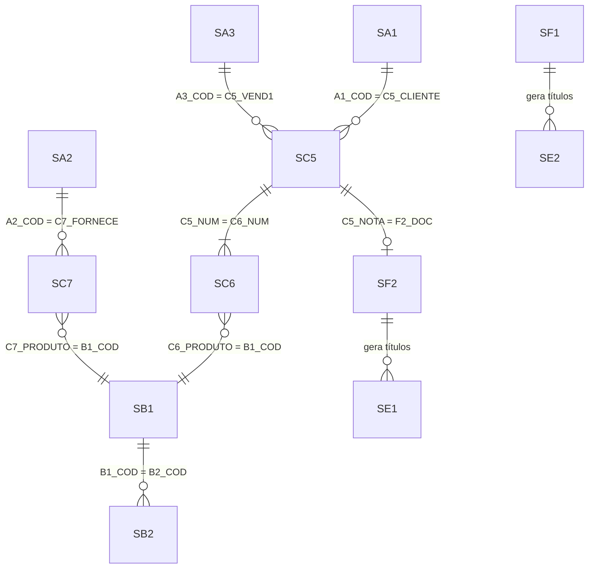

# TOTVS Protheus - Tabelas Principais

## Convenção

- **Prefixo de campo**: 2 caracteres da tabela + `_` (ex: `A1_COD` = campo `COD` da tabela `SA1`)
- **D_E_L_E_T_**: Sempre filtrar `<> '*'` em SQL
- **R_E_C_N_O_**: PK interna auto-incremento
- **Sufixo tabela**: Empresa+Filial (ex: `SA1010`)

---

## 1. Cadastros

| Tabela | Descrição | Prefixo |
|:---|:---|:---|
| `SA1` | Clientes | `A1_` |
| `SA2` | Fornecedores | `A2_` |
| `SA3` | Vendedores | `A3_` |
| `SA6` | Bancos | `A6_` |
| `SB1` | Produtos | `B1_` |
| `SB2` | Saldos de Estoque | `B2_` |

### SA1 — Clientes (Campos Principais)
`A1_FILIAL`, `A1_COD`, `A1_LOJA`, `A1_NOME` (razão social), `A1_NREDUZ` (fantasia), `A1_CGC` (CNPJ/CPF), `A1_INSCR` (IE), `A1_END`, `A1_MUN`, `A1_EST`, `A1_CEP`, `A1_TEL`, `A1_EMAIL`, `A1_LC` (limite crédito), `A1_COND` (condição pagamento), `A1_VEND` (vendedor)

**Chave**: `A1_FILIAL` + `A1_COD` + `A1_LOJA`

### SA2 — Fornecedores (Campos Principais)
`A2_FILIAL`, `A2_COD`, `A2_LOJA`, `A2_NOME`, `A2_NREDUZ`, `A2_CGC`, `A2_INSCR`, `A2_END`, `A2_MUN`, `A2_EST`, `A2_CEP`, `A2_TEL`, `A2_EMAIL`

**Chave**: `A2_FILIAL` + `A2_COD` + `A2_LOJA`

### SA3 — Vendedores
`A3_COD`, `A3_NOME`, `A3_COMIS` (% comissão), `A3_EMAIL`, `A3_TEL`

### SB1 — Produtos (Campos Principais)
`B1_FILIAL`, `B1_COD`, `B1_DESC` (descrição), `B1_TIPO` (PA/MP/ME/PI), `B1_UM` (unidade medida), `B1_GRUPO`, `B1_PRV1` (preço venda), `B1_CUSTD` (custo padrão), `B1_PICM` (% ICMS), `B1_IPI` (% IPI), `B1_NCM` (NCM), `B1_POSIPI`

**Chave**: `B1_FILIAL` + `B1_COD`

**Tipos de produto (B1_TIPO):**
| Código | Tipo |
|:---|:---|
| `PA` | Produto Acabado |
| `MP` | Matéria-Prima |
| `ME` | Material de Embalagem |
| `PI` | Produto Intermediário |
| `MC` | Material de Consumo |
| `BN` | Beneficiamento |
| `MO` | Mão de Obra |

### SB2 — Saldos de Estoque
`B2_FILIAL`, `B2_COD`, `B2_LOCAL`, `B2_QATU` (qtd atual), `B2_QRES` (qtd reservada), `B2_VATU1` (valor custo), `B2_CM1` (custo médio)

---

## 2. Vendas

| Tabela | Descrição | Prefixo |
|:---|:---|:---|
| `SC5` | Pedidos de Venda (Cabeçalho) | `C5_` |
| `SC6` | Itens do Pedido de Venda | `C6_` |
| `SC9` | Liberações de Pedidos | `C9_` |
| `SF2` | NF de Saída (Cabeçalho) | `F2_` |
| `SD2` | Itens da NF de Saída | `D2_` |

### SC5 — Pedido de Venda (Cabeçalho)
`C5_FILIAL`, `C5_NUM`, `C5_EMISSAO`, `C5_CLIENTE`, `C5_LOJACLI`, `C5_CONDPAG`, `C5_VEND1`, `C5_NOTA` (nº NF gerada), `C5_LIBEROK` (liberado S/N), `C5_BLQ` (bloqueado), `C5_TPFRETE`

### SC6 — Itens do Pedido
`C6_FILIAL`, `C6_NUM`, `C6_ITEM`, `C6_PRODUTO`, `C6_QTDVEN`, `C6_PRCVEN`, `C6_VALOR`, `C6_TES`, `C6_DESCONT`, `C6_ENTREG` (data entrega)

**Relacionamento**: `SC5.C5_NUM = SC6.C6_NUM` + `C5_FILIAL = C6_FILIAL`

---

## 3. Compras

| Tabela | Descrição | Prefixo |
|:---|:---|:---|
| `SC7` | Pedidos de Compra | `C7_` |
| `SF1` | NF de Entrada (Cabeçalho) | `F1_` |
| `SD1` | Itens da NF de Entrada | `D1_` |

### SC7 — Pedido de Compra
`C7_FILIAL`, `C7_NUM`, `C7_ITEM`, `C7_PRODUTO`, `C7_QUANT`, `C7_PRECO`, `C7_TOTAL`, `C7_FORNECE`, `C7_LOJA`, `C7_COND`, `C7_EMISSAO`

---

## 4. Financeiro

| Tabela | Descrição | Prefixo |
|:---|:---|:---|
| `SE1` | Títulos a Receber | `E1_` |
| `SE2` | Títulos a Pagar | `E2_` |
| `SE5` | Movimentação Bancária | `E5_` |
| `FK2` | Lançamentos Financeiros | `FK2_` |

### SE1 — Títulos a Receber
`E1_FILIAL`, `E1_NUM`, `E1_PREFIXO`, `E1_PARCELA`, `E1_TIPO`, `E1_CLIENTE`, `E1_LOJA`, `E1_EMISSAO`, `E1_VENCTO`, `E1_VALOR`, `E1_SALDO`, `E1_BAIXA` (data baixa), `E1_NATUREZ` (natureza financeira)

**Chave**: `E1_FILIAL` + `E1_PREFIXO` + `E1_NUM` + `E1_PARCELA` + `E1_TIPO`

### SE2 — Títulos a Pagar
`E2_FILIAL`, `E2_NUM`, `E2_PREFIXO`, `E2_PARCELA`, `E2_TIPO`, `E2_FORNECE`, `E2_LOJA`, `E2_EMISSAO`, `E2_VENCTO`, `E2_VALOR`, `E2_SALDO`, `E2_BAIXA`, `E2_NATUREZ`

---

## 5. Contabilidade

| Tabela | Descrição | Prefixo |
|:---|:---|:---|
| `SI1` / `CT1` | Plano de Contas | `CT1_` |
| `SI2` / `CT2` | Lançamentos Contábeis | `CT2_` |
| `CTT` | Centros de Custo | `CTT_` |

---

## 6. Fiscal

| Tabela | Descrição | Prefixo |
|:---|:---|:---|
| `SF3` | Livros Fiscais | `F3_` |
| `SF4` | TES (Tipo Entrada/Saída) | `F4_` |
| `SFB` | Impostos Variáveis | `FB_` |
| `CDO` | Complemento NF-e | `CDO_` |

---

## Relacionamentos Principais

> [!WARNING]
> Os nomes de campos e tabelas podem variar com a versão/release do Protheus. Valide com `SX2`/`SX3` do seu ambiente.
