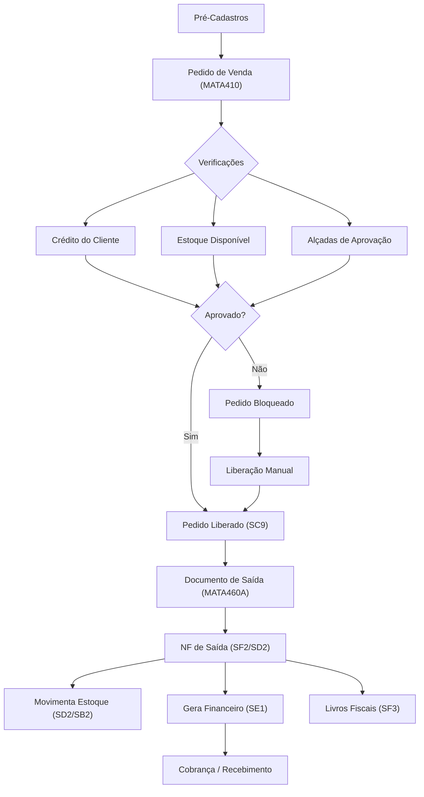

# TOTVS Protheus - Fluxo de Pedidos e Faturamento

## Visão Geral do Fluxo



---

## Pré-Cadastros Necessários

| Cadastro | Tabela | Rotina | Obrigatório |
|:---|:---|:---|:---|
| Produtos | `SB1` | MATA010 | ✅ |
| Clientes | `SA1` | MATA030 | ✅ |
| Vendedores | `SA3` | MATA040 | ✅ |
| Condição de Pagamento | `SE4` | MATA360 | ✅ |
| TES (Tipo Entrada/Saída) | `SF4` | MATA080 | ✅ |
| Natureza Financeira | `SED` | MATA070 | Recomendado |

### TES (SF4) — Conceito Importante

A **TES** controla o comportamento fiscal e operacional de cada movimentação:

| Campo | Função |
|:---|:---|
| `F4_ESTOQUE` | Movimenta estoque? (S/N) |
| `F4_DUPLIC` | Gera duplicata/financeiro? (S/N) |
| `F4_ICM` | Calcula ICMS? (S/N) |
| `F4_IPI` | Calcula IPI? (S/N) |
| `F4_PODER3` | Remessa a terceiros? (S/N) |

---

## Etapas do Fluxo

### 1. Pedido de Venda (MATA410)

**Módulo**: SIGAFAT (Faturamento)

**Inclusão do pedido**:
- Informar cliente, produtos, quantidades, preços
- Definir condição de pagamento e TES
- O sistema valida regras de negócio automaticamente

**Tabelas afetadas**:
| Tabela | Ação |
|:---|:---|
| `SC5` | Insere cabeçalho do pedido |
| `SC6` | Insere itens do pedido |
| `SB2` | Reserva estoque (`B2_QRES`) |

**Tecla F12**: Use para configurar parâmetros da rotina (ex: libera sem estoque, valida crédito).

---

### 2. Liberação de Pedidos (MATA411)

Pedidos podem ser bloqueados por:

| Motivo | Regra |
|:---|:---|
| Crédito | Valor excede `SA1.A1_LC` (limite crédito) |
| Estoque | Sem estoque disponível em `SB2` |
| Desconto | Desconto acima do permitido |
| Alçada | Valor acima da alçada do vendedor |

**Liberação**: Feita pelo supervisor/gerente na rotina MATA411.

**Tabela SC9**: Registra as liberações de pedidos.

---

### 3. Documento de Saída / NF (MATA460A)

**Módulo**: SIGAFAT

Gera a nota fiscal de saída a partir do pedido liberado.

**Tabelas afetadas**:
| Tabela | Ação |
|:---|:---|
| `SF2` | Cabeçalho da NF de saída |
| `SD2` | Itens da NF de saída |
| `SB2` | Baixa estoque (`B2_QATU`) |
| `SF3` | Livros fiscais |
| `SE1` | Títulos a receber (se TES gera financeiro) |
| `SC5` | Atualiza com nº da NF (`C5_NOTA`) |

---

### 4. Integração Automática com Financeiro

Se a TES está configurada com `F4_DUPLIC = 'S'`:

1. O sistema gera títulos em `SE1` (contas a receber)
2. Parcelas conforme a condição de pagamento (`SE4`)
3. Natureza financeira conforme configuração

**Campos gerados no SE1:**
- `E1_NUM` = Número da NF
- `E1_PREFIXO` = Série da NF
- `E1_VALOR` = Valor da parcela
- `E1_VENCTO` = Calculado pela condição de pagamento
- `E1_CLIENTE` = Código do cliente

---

## Rotinas Principais (Resumo)

| Rotina | Código | Módulo | Descrição |
|:---|:---|:---|:---|
| Pedido de Venda | MATA410 | SIGAFAT | Incluir/consultar pedidos |
| Liberação de Pedidos | MATA411 | SIGAFAT | Liberar pedidos bloqueados |
| Documento de Saída | MATA460A | SIGAFAT | Gerar NF de saída |
| Contas a Receber | FINA040 | SIGAFIN | Gerenciar títulos CR |
| Contas a Pagar | FINA050 | SIGAFIN | Gerenciar títulos CP |
| Baixas a Receber | FINA070 | SIGAFIN | Baixar títulos CR |
| Baixas a Pagar | FINA080 | SIGAFIN | Baixar títulos CP |

---

## Consultas de Acompanhamento

### Pedidos Pendentes de Liberação
```sql
SELECT C5_NUM, C5_EMISSAO, C5_CLIENTE, SA1.A1_NOME,
    SUM(C6_VALOR) AS TOTAL
FROM SC5010 SC5
INNER JOIN SC6010 SC6 ON SC5.C5_NUM = SC6.C6_NUM AND SC6.D_E_L_E_T_ = ' '
INNER JOIN SA1010 SA1 ON SC5.C5_CLIENTE = SA1.A1_COD AND SA1.D_E_L_E_T_ = ' '
WHERE SC5.D_E_L_E_T_ = ' '
  AND SC5.C5_LIBEROK <> 'E'  -- Não liberado
  AND SC5.C5_NOTA = '         '  -- Sem NF
GROUP BY C5_NUM, C5_EMISSAO, C5_CLIENTE, SA1.A1_NOME
ORDER BY C5_EMISSAO;
```

### Pedidos Faturados no Mês
```sql
SELECT C5_NUM, C5_EMISSAO, C5_NOTA, SA1.A1_NOME AS CLIENTE,
    SUM(C6_VALOR) AS TOTAL
FROM SC5010 SC5
INNER JOIN SC6010 SC6 ON SC5.C5_NUM = SC6.C6_NUM AND SC6.D_E_L_E_T_ = ' '
INNER JOIN SA1010 SA1 ON SC5.C5_CLIENTE = SA1.A1_COD AND SA1.D_E_L_E_T_ = ' '
WHERE SC5.D_E_L_E_T_ = ' '
  AND SC5.C5_NOTA <> '         '
  AND SC5.C5_EMISSAO >= FORMAT(DATEADD(MONTH, DATEDIFF(MONTH,0,GETDATE()),0), 'yyyyMMdd')
GROUP BY C5_NUM, C5_EMISSAO, C5_NOTA, SA1.A1_NOME;
```

> [!TIP]
> Use a tecla **F12** nas rotinas de pedido e faturamento para ajustar comportamentos como: liberar sem estoque, agrupar pedidos na NF, etc.
