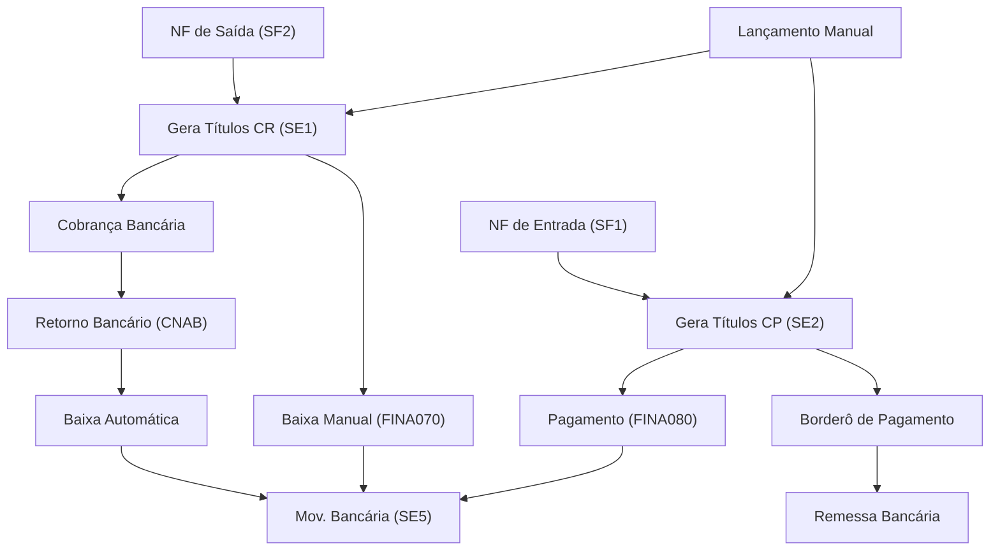

# TOTVS Protheus - Módulo Financeiro (SIGAFIN)

## Visão Geral

O módulo **SIGAFIN** controla toda a gestão financeira: contas a receber, contas a pagar, movimentação bancária, fluxo de caixa e conciliação.

## Fluxo Financeiro



---

## Contas a Receber (SE1)

### Como é gerado
- **Automático**: Faturamento de NF (se TES com `F4_DUPLIC = 'S'`)
- **Manual**: Rotina FINA040

### Campos Principais
| Campo | Descrição |
|:---|:---|
| `E1_FILIAL` | Filial |
| `E1_PREFIXO` | Prefixo (série da NF) |
| `E1_NUM` | Número do título |
| `E1_PARCELA` | Parcela |
| `E1_TIPO` | Tipo (NF, DP, TX, etc.) |
| `E1_CLIENTE` | Código do cliente |
| `E1_LOJA` | Loja do cliente |
| `E1_EMISSAO` | Data de emissão (YYYYMMDD) |
| `E1_VENCTO` | Data de vencimento |
| `E1_VALOR` | Valor original |
| `E1_SALDO` | Saldo em aberto |
| `E1_BAIXA` | Data da baixa |
| `E1_NATUREZ` | Natureza financeira |
| `E1_PORTADO` | Banco portador |
| `E1_APTS` | Agência portadora |
| `E1_NUMBCO` | Nosso número (bancário) |

### Tipos de Título (E1_TIPO)
| Tipo | Descrição |
|:---|:---|
| `NF` | Nota Fiscal |
| `DP` | Duplicata |
| `NCC` | Nota de Crédito |
| `NDB` | Nota de Débito |
| `TX` | Taxa |
| `PR` | Provisão |

### Rotinas
| Rotina | Código | Descrição |
|:---|:---|:---|
| Contas a Receber | FINA040 | Incluir/consultar títulos |
| Baixas a Receber | FINA070 | Baixar títulos |
| Compensação CR | FINA042 | Compensar títulos |
| Borderô de Cobrança | FINA060 | Gerar remessa bancária |
| Retorno Bancário | FINA430 | Processar retorno CNAB |

### Consulta: Aging de Recebíveis
```sql
SELECT 
    CASE 
        WHEN E1_VENCTO >= FORMAT(GETDATE(),'yyyyMMdd') THEN 'A Vencer'
        WHEN DATEDIFF(DAY, CAST(E1_VENCTO AS DATE), GETDATE()) BETWEEN 1 AND 30 THEN '1-30 dias'
        WHEN DATEDIFF(DAY, CAST(E1_VENCTO AS DATE), GETDATE()) BETWEEN 31 AND 60 THEN '31-60 dias'
        WHEN DATEDIFF(DAY, CAST(E1_VENCTO AS DATE), GETDATE()) BETWEEN 61 AND 90 THEN '61-90 dias'
        ELSE 'Acima 90 dias'
    END AS FAIXA,
    COUNT(*) AS QTD,
    SUM(E1_SALDO) AS SALDO
FROM SE1010
WHERE D_E_L_E_T_ = ' ' AND E1_SALDO > 0
GROUP BY CASE 
    WHEN E1_VENCTO >= FORMAT(GETDATE(),'yyyyMMdd') THEN 'A Vencer'
    WHEN DATEDIFF(DAY, CAST(E1_VENCTO AS DATE), GETDATE()) BETWEEN 1 AND 30 THEN '1-30 dias'
    WHEN DATEDIFF(DAY, CAST(E1_VENCTO AS DATE), GETDATE()) BETWEEN 31 AND 60 THEN '31-60 dias'
    WHEN DATEDIFF(DAY, CAST(E1_VENCTO AS DATE), GETDATE()) BETWEEN 61 AND 90 THEN '61-90 dias'
    ELSE 'Acima 90 dias' END;
```

---

## Contas a Pagar (SE2)

### Como é gerado
- **Automático**: Entrada de NF de compra (se TES gera financeiro)
- **Manual**: Rotina FINA050

### Campos Principais
| Campo | Descrição |
|:---|:---|
| `E2_FILIAL` | Filial |
| `E2_PREFIXO` | Prefixo |
| `E2_NUM` | Número do título |
| `E2_PARCELA` | Parcela |
| `E2_TIPO` | Tipo |
| `E2_FORNECE` | Código do fornecedor |
| `E2_LOJA` | Loja do fornecedor |
| `E2_EMISSAO` | Data emissão |
| `E2_VENCTO` | Data vencimento |
| `E2_VALOR` | Valor original |
| `E2_SALDO` | Saldo em aberto |
| `E2_BAIXA` | Data da baixa |
| `E2_NATUREZ` | Natureza financeira |

### Rotinas
| Rotina | Código | Descrição |
|:---|:---|:---|
| Contas a Pagar | FINA050 | Incluir/consultar títulos |
| Baixas a Pagar | FINA080 | Baixar/pagar títulos |
| Borderô Pagamento | FINA100 | Gerar remessa de pagamento |
| Compensação CP | FINA052 | Compensar títulos |

### Consulta: Compromissos da Semana
```sql
SELECT 
    E2_NUM, E2_PREFIXO, E2_PARCELA,
    SA2.A2_NOME AS FORNECEDOR,
    E2_VENCTO, E2_VALOR, E2_SALDO
FROM SE2010 SE2
INNER JOIN SA2010 SA2 ON SE2.E2_FORNECE = SA2.A2_COD 
    AND SE2.E2_LOJA = SA2.A2_LOJA AND SA2.D_E_L_E_T_ = ' '
WHERE SE2.D_E_L_E_T_ = ' '
  AND SE2.E2_SALDO > 0
  AND SE2.E2_VENCTO BETWEEN FORMAT(GETDATE(),'yyyyMMdd') 
      AND FORMAT(DATEADD(DAY,7,GETDATE()),'yyyyMMdd')
ORDER BY E2_VENCTO;
```

---

## Movimentação Bancária (SE5)

Registra todas as entradas e saídas em contas bancárias.

### Campos Principais
| Campo | Descrição |
|:---|:---|
| `E5_FILIAL` | Filial |
| `E5_DATA` | Data da movimentação |
| `E5_BANCO` | Código do banco |
| `E5_AGENCIA` | Agência |
| `E5_CONTA` | Conta corrente |
| `E5_VALOR` | Valor |
| `E5_RECPAG` | R=Recebimento, P=Pagamento |
| `E5_NATUREZ` | Natureza financeira |
| `E5_HISTOR` | Histórico |

### Consulta: Extrato Bancário do Mês
```sql
SELECT E5_DATA, E5_HISTOR,
    CASE WHEN E5_RECPAG = 'R' THEN E5_VALOR ELSE 0 END AS CREDITO,
    CASE WHEN E5_RECPAG = 'P' THEN E5_VALOR ELSE 0 END AS DEBITO
FROM SE5010
WHERE D_E_L_E_T_ = ' '
  AND E5_BANCO = '001'
  AND E5_DATA >= FORMAT(DATEADD(MONTH,DATEDIFF(MONTH,0,GETDATE()),0),'yyyyMMdd')
ORDER BY E5_DATA;
```

---

## Fluxo de Caixa Projetado
```sql
-- Entradas (Receber)
SELECT 'CR' AS TIPO, E1_VENCTO AS DATA, SUM(E1_SALDO) AS VALOR
FROM SE1010 WHERE D_E_L_E_T_ = ' ' AND E1_SALDO > 0
  AND E1_VENCTO BETWEEN FORMAT(GETDATE(),'yyyyMMdd') AND FORMAT(DATEADD(DAY,30,GETDATE()),'yyyyMMdd')
GROUP BY E1_VENCTO
UNION ALL
-- Saídas (Pagar)
SELECT 'CP', E2_VENCTO, SUM(E2_SALDO) * -1
FROM SE2010 WHERE D_E_L_E_T_ = ' ' AND E2_SALDO > 0
  AND E2_VENCTO BETWEEN FORMAT(GETDATE(),'yyyyMMdd') AND FORMAT(DATEADD(DAY,30,GETDATE()),'yyyyMMdd')
GROUP BY E2_VENCTO
ORDER BY 2;
```

---

## Parâmetros Financeiros Importantes (SX6)

| Parâmetro | Descrição |
|:---|:---|
| `MV_1DUP` | Formato do nº da duplicata |
| `MV_SALTIT` | Considera saldo no título |
| `MV_JUROS` | Taxa de juros padrão |
| `MV_MULTA` | % Multa por atraso |
| `MV_MOTEFIN` | Motivo de baixa financeira |
| `MV_DTEFIN` | Data do financeiro |

> [!NOTE]
> As datas no Protheus são armazenadas como `VARCHAR(8)` no formato `YYYYMMDD`. Isso impacta comparações e formatações em SQL.

> [!TIP]
> Use o **Configurador (SIGACFG)** → Parâmetros para visualizar e alterar os parâmetros `MV_` do seu ambiente.
