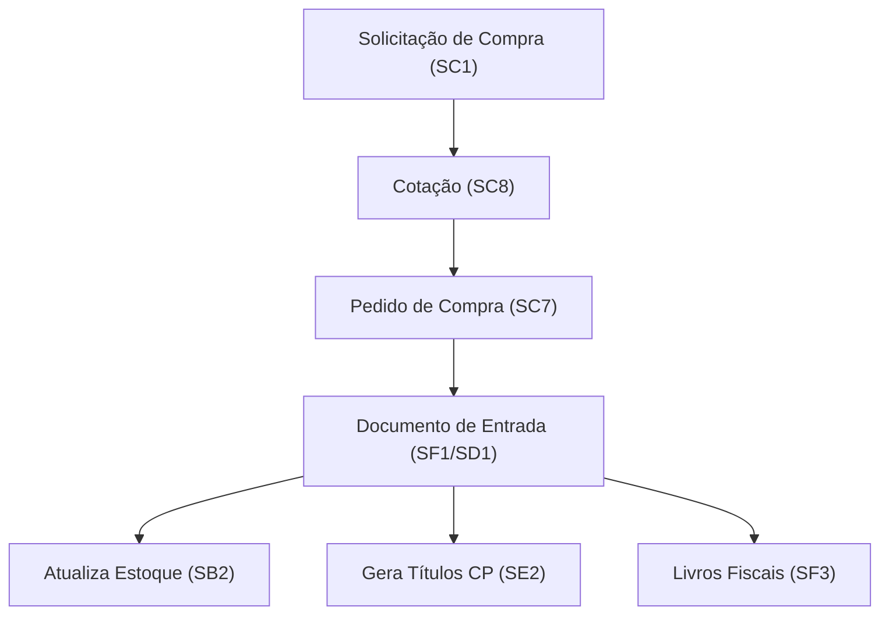

# TOTVS Protheus - Estoque e Compras

## Estoque (SIGAEST)

### Tabelas Principais

| Tabela | Descrição | Prefixo |
|:---|:---|:---|
| `SB1` | Cadastro de Produtos | `B1_` |
| `SB2` | Saldos de Estoque | `B2_` |
| `SB5` | Dados Complementares do Produto | `B5_` |
| `SBE` | Endereços de Estoque | `BE_` |
| `SD3` | Movimentações Internas | `D3_` |

### Campos do Saldo (SB2)

| Campo | Descrição |
|:---|:---|
| `B2_COD` | Código do produto |
| `B2_LOCAL` | Armazém |
| `B2_QATU` | Quantidade atual |
| `B2_QRES` | Quantidade reservada |
| `B2_QEMP` | Quantidade empenhada (OP) |
| `B2_QPRD` | Quantidade prevista produção |
| `B2_VATU1` | Valor total do estoque |
| `B2_CM1` | Custo médio |

### Fórmula de Disponibilidade
```
DISPONÍVEL = B2_QATU - B2_QRES - B2_QEMP
```

### Consultas

#### Posição de Estoque
```sql
SELECT SB2.B2_COD, SB1.B1_DESC, SB2.B2_LOCAL,
    SB2.B2_QATU AS QTD_ATUAL,
    SB2.B2_QRES AS RESERVADO,
    SB2.B2_QEMP AS EMPENHADO,
    SB2.B2_QATU - SB2.B2_QRES - SB2.B2_QEMP AS DISPONIVEL,
    SB2.B2_CM1 AS CUSTO_MEDIO,
    SB2.B2_QATU * SB2.B2_CM1 AS VALOR_ESTOQUE
FROM SB2010 SB2
INNER JOIN SB1010 SB1 ON SB2.B2_COD = SB1.B1_COD AND SB1.D_E_L_E_T_ = ' '
WHERE SB2.D_E_L_E_T_ = ' '
  AND SB2.B2_QATU > 0
ORDER BY SB1.B1_DESC;
```

#### Estoque Abaixo do Mínimo
```sql
SELECT SB1.B1_COD, SB1.B1_DESC,
    SB2.B2_QATU AS ESTOQUE,
    SB1.B1_EMIN AS MINIMO,
    SB1.B1_EMAX AS MAXIMO
FROM SB1010 SB1
INNER JOIN SB2010 SB2 ON SB1.B1_COD = SB2.B2_COD AND SB2.D_E_L_E_T_ = ' '
WHERE SB1.D_E_L_E_T_ = ' '
  AND SB2.B2_QATU < SB1.B1_EMIN
  AND SB1.B1_EMIN > 0
ORDER BY SB2.B2_QATU;
```

### Rotinas de Estoque

| Rotina | Código | Descrição |
|:---|:---|:---|
| Cadastro de Produtos | MATA010 | Incluir/alterar produtos |
| Saldos Iniciais | MATA220 | Carga inicial de estoque |
| Movimentações Internas | MATA240 | Transferências, ajustes |
| Inventário | MATA340 | Contagem de estoque |
| Consulta de Estoque | MATA225 | Consultar saldos |

---

## Compras (SIGACOM)

### Tabelas Principais

| Tabela | Descrição | Prefixo |
|:---|:---|:---|
| `SC7` | Pedidos de Compra | `C7_` |
| `SC8` | Cotações | `C8_` |
| `SF1` | NF de Entrada (Cabeçalho) | `F1_` |
| `SD1` | Itens NF de Entrada | `D1_` |
| `SA2` | Fornecedores | `A2_` |

### Fluxo de Compras



### Campos do Pedido de Compra (SC7)

| Campo | Descrição |
|:---|:---|
| `C7_NUM` | Número do pedido |
| `C7_ITEM` | Item do pedido |
| `C7_PRODUTO` | Código do produto |
| `C7_QUANT` | Quantidade pedida |
| `C7_QUJE` | Quantidade já entregue |
| `C7_PRECO` | Preço unitário |
| `C7_TOTAL` | Valor total |
| `C7_FORNECE` | Fornecedor |
| `C7_COND` | Condição de pagamento |
| `C7_EMISSAO` | Data de emissão |
| `C7_DATPRF` | Data prevista de entrega |
| `C7_RESIDUO` | Eliminado (S/N) |

### Consultas

#### Pedidos de Compra em Aberto
```sql
SELECT C7_NUM, C7_ITEM, C7_PRODUTO, SB1.B1_DESC,
    SA2.A2_NOME AS FORNECEDOR,
    C7_QUANT AS PEDIDO,
    C7_QUJE AS ENTREGUE,
    C7_QUANT - C7_QUJE AS PENDENTE,
    C7_DATPRF AS PREVISAO
FROM SC7010 SC7
INNER JOIN SB1010 SB1 ON SC7.C7_PRODUTO = SB1.B1_COD AND SB1.D_E_L_E_T_ = ' '
INNER JOIN SA2010 SA2 ON SC7.C7_FORNECE = SA2.A2_COD AND SA2.D_E_L_E_T_ = ' '
WHERE SC7.D_E_L_E_T_ = ' '
  AND SC7.C7_QUANT - SC7.C7_QUJE > 0
  AND SC7.C7_RESIDUO <> 'S'
ORDER BY C7_DATPRF;
```

#### NFs de Entrada do Mês
```sql
SELECT F1_DOC, F1_SERIE, F1_EMISSAO, SA2.A2_NOME AS FORNECEDOR,
    F1_VALBRUT AS VALOR
FROM SF1010 SF1
INNER JOIN SA2010 SA2 ON SF1.F1_FORNECE = SA2.A2_COD AND SA2.D_E_L_E_T_ = ' '
WHERE SF1.D_E_L_E_T_ = ' '
  AND SF1.F1_EMISSAO >= FORMAT(DATEADD(MONTH,DATEDIFF(MONTH,0,GETDATE()),0),'yyyyMMdd')
ORDER BY F1_EMISSAO DESC;
```

### Rotinas de Compras

| Rotina | Código | Descrição |
|:---|:---|:---|
| Solicitação de Compra | MATA110 | Solicitar compra |
| Cotação | MATA120 | Cotar fornecedores |
| Pedido de Compra | MATA120 | Gerar pedido |
| Documento de Entrada | MATA103 | Incluir NF de entrada |
| Autorização de Entrega | MATA140 | Liberar entregas |

> [!NOTE]
> O módulo SIGACOM possui controle de **alçadas de aprovação** que podem bloquear pedidos de compra acima de determinados valores, exigindo liberação de nível superior.
