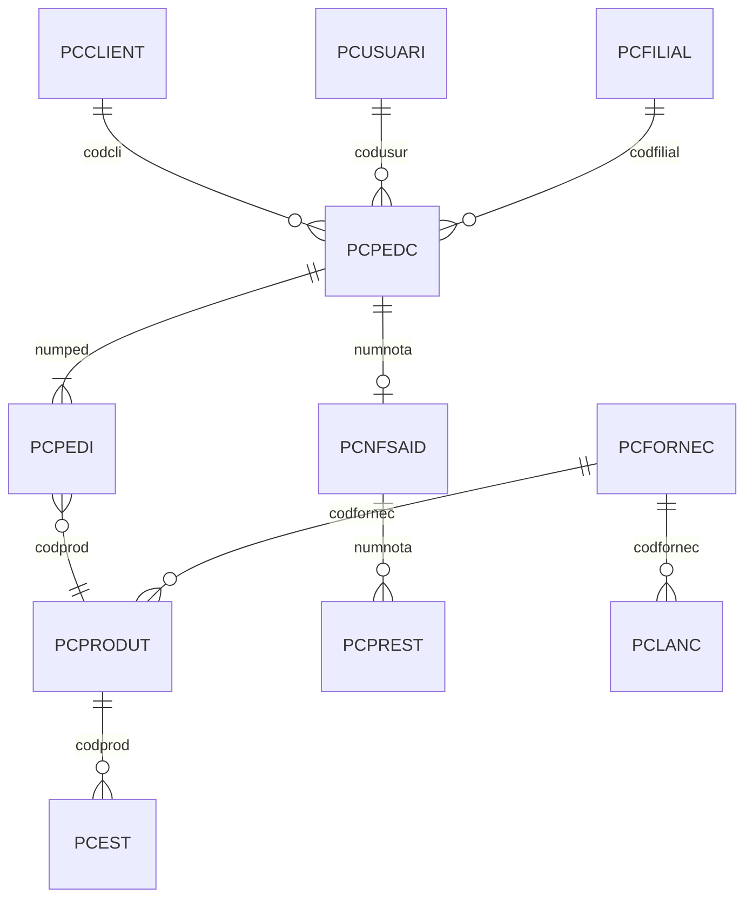

# TOTVS Winthor - Tabelas Principais

Todas as tabelas seguem o padrão **`PC` + nome descritivo**.

## 1. Cadastros

| Tabela | Descrição | Chave (PK) |
|:---|:---|:---|
| `PCCLIENT` | Cadastro de Clientes | `CODCLI` |
| `PCFORNEC` | Cadastro de Fornecedores | `CODFORNEC` |
| `PCPRODUT` | Cadastro de Produtos | `CODPROD` |
| `PCUSUARI` | Cadastro de RCAs/Usuários | `CODUSUR` |
| `PCEMPR` | Cadastro de Funcionários | `MATRICULA` |
| `PCFILIAL` | Cadastro de Filiais | `CODIGO` |
| `PCSUPERV` | Cadastro de Supervisores | `CODSUPERVISOR` |

### PCCLIENT — Campos Principais
`CODCLI`, `CLIENTE` (razão social), `FANTASIA`, `CGCENT` (CNPJ/CPF), `IEENT` (IE), `ENDERENT`, `MUNICENT`, `ESTENT`, `CEPENT`, `TELENT`, `EMAIL`, `CODCOB`, `CODPLPAG`, `BLOQUEIO` (S/N), `LIMCRED`, `DTCADASTRO`, `DTULTCOMP`

### PCPRODUT — Campos Principais
`CODPROD`, `DESCRICAO`, `CODAUXILIAR` (EAN), `EMBALAGEM`, `UNIDADE`, `QTUNIT`, `CODFORNEC`, `CODSEC`, `CODCATEGORIA`, `CODMARCA`, `PESOBRUTO`, `PESOLIQ`, `NBM` (NCM), `ORIGMERCADORIA`, `DTCADASTRO`

### PCFORNEC — Campos Principais
`CODFORNEC`, `FORNECEDOR`, `FANTASIA`, `CGC` (CNPJ), `IE`, `ENDERECO`, `MUNICIPIO`, `ESTADO`, `CEP`, `TELEFONE`, `EMAIL`

### PCUSUARI — Campos Principais
`CODUSUR`, `NOME`, `CODSUPERVISOR`, `CODGERENTE`, `SITUACAO` (A/I), `PERCCOMISSAO`, `TIPOVENDA`

---

## 2. Vendas e Faturamento

| Tabela | Descrição | Chave (PK) |
|:---|:---|:---|
| `PCPEDC` | Pedidos de Venda (Cabeçalho) | `NUMPED` |
| `PCPEDI` | Itens do Pedido de Venda | `NUMPED` + `NUMSEQ` |
| `PCNFSAID` | Notas Fiscais de Saída | `NUMNOTA` |
| `PCMOV` | Movimentação de Produtos | `NUMTRANSACAO` |
| `PCTABPR` | Tabela de Preços | `CODPROD` + `NUMREGIAO` |

### PCPEDC — Campos Principais
`NUMPED`, `CODCLI`, `CODUSUR`, `CODSUPERVISOR`, `DATA`, `CODPLPAG`, `CODCOB`, `CODFILIAL`, `VLTOTAL`, `POSICAO` (P=Pendente, L=Liberado, F=Faturado, C=Cancelado, B=Bloqueado), `NUMCAR`, `NUMNOTA`, `OBS`

### PCPEDI — Campos Principais
`NUMPED`, `CODPROD`, `NUMSEQ`, `QT`, `PVENDA`, `PTABELA`, `PERCDESC`, `VLSUBTOTAL`, `CODFILIAL`

### PCNFSAID — Campos Principais
`NUMNOTA`, `CODCLI`, `CODUSUR`, `DTSAIDA`, `DTBASE`, `VLTOTAL`, `VLTOTPROD`, `CODFILIAL`, `NUMPED`, `SERIE`, `ESPECIE`, `CHAVENFE`, `CONDVENDA`

---

## 3. Financeiro

| Tabela | Descrição | Chave (PK) |
|:---|:---|:---|
| `PCPREST` | Contas a Receber | `NUMNOTA` + `PREST` |
| `PCLANC` | Contas a Pagar | `NUMTRANSACAO` |
| `PCBANCO` | Caixas e Bancos | `CODBANCO` |
| `PCCOB` | Tipos de Cobrança | `CODCOB` |
| `PCMOVCR` | Movimentação de Numerários | `NUMTRANSVENDA` |

### PCPREST — Campos Principais
`NUMNOTA`, `PREST`, `CODCLI`, `CODCOB`, `DTVENC`, `VALOR`, `VLPAGO`, `DTPAGTO`, `VPAGO` (S/N), `CODFILIAL`, `CODBANCO`

### PCLANC — Campos Principais
`NUMTRANSACAO`, `CODFORNEC`, `NUMNOTA`, `DTVENC`, `VALOR`, `DTPAGTO`, `CODFILIAL`, `TIPOPAGTO`

---

## 4. Estoque e Logística

| Tabela | Descrição | Chave (PK) |
|:---|:---|:---|
| `PCEST` | Estoque Atual | `CODPROD` + `CODFILIAL` |
| `PCPRODFILIAL` | Produtos por Filial | `CODPROD` + `CODFILIAL` |
| `PCCARREG` | Carregamentos | `NUMCAR` |
| `PCROTA` | Cadastro de Rotas | `CODROTA` |

### PCEST — Campos Principais
`CODPROD`, `CODFILIAL`, `QTESTGER`, `QTRESERV`, `QTBLOQUEADA`, `QTPENDENTE`, `CUSTOULTENT`, `CUSTOMED`, `DTULTENT`, `DTULTSAIDA`

---

## 5. Parâmetros

| Tabela | Descrição |
|:---|:---|
| `PCCONSUM` | Parâmetros gerais do sistema (Rotina 132) |
| `PCPARAMFILIAL` | Parâmetros específicos por filial |

---

## Relacionamentos Principais

> [!WARNING]
> Campos e tipos podem variar conforme a versão do Winthor. Valide com a estrutura real do seu banco.
