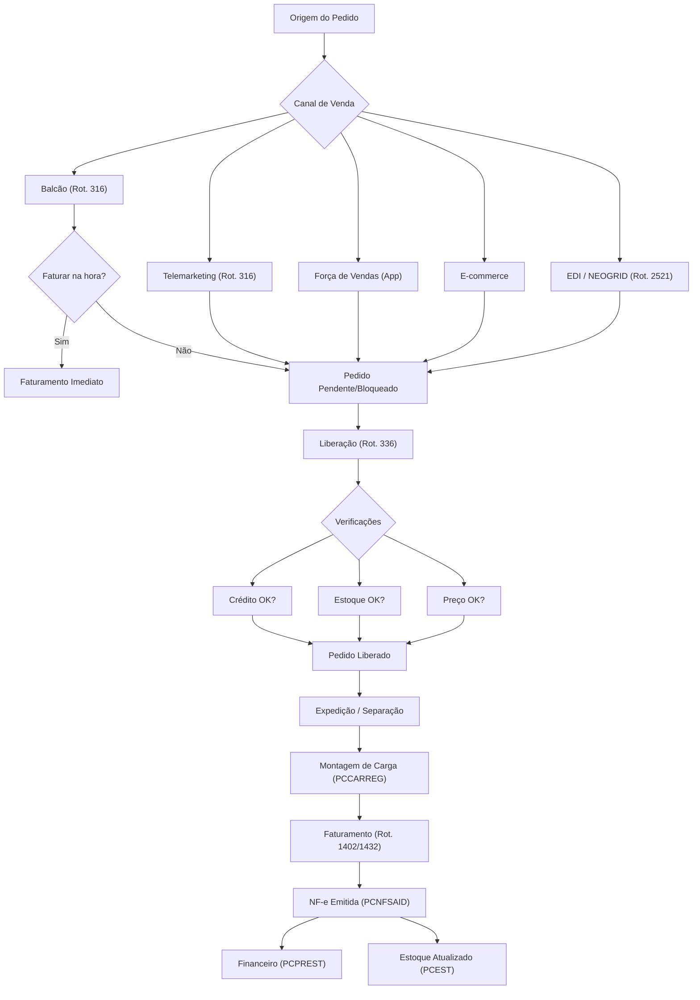

# TOTVS Winthor - Fluxo de Pedidos

## Visão Geral do Fluxo



---

## Etapas Detalhadas

### 1. Digitação do Pedido (Rotina 316)

A rotina 316 é a principal entrada de pedidos no Winthor.

**Dados obrigatórios:**
- Código do cliente (`CODCLI`)
- RCA/Vendedor (`CODUSUR`)
- Filial (`CODFILIAL`)
- Plano de pagamento (`CODPLPAG`)
- Tipo de cobrança (`CODCOB`)
- Produtos e quantidades

**Tabelas afetadas:**
| Tabela | Ação |
|:---|:---|
| `PCPEDC` | Insere cabeçalho do pedido |
| `PCPEDI` | Insere itens do pedido |
| `PCEST` | Reserva estoque (`QTRESERV`) |

**Status do pedido (campo `POSICAO`):**
| Código | Status | Descrição |
|:---|:---|:---|
| `P` | Pendente | Aguardando liberação |
| `B` | Bloqueado | Bloqueado por regra de negócio |
| `L` | Liberado | Pronto para faturamento |
| `F` | Faturado | Nota fiscal emitida |
| `C` | Cancelado | Pedido cancelado |

---

### 2. Liberação do Pedido (Rotina 336)

A rotina 336 permite consultar, alterar e liberar pedidos.

**Verificações automáticas:**
- **Crédito**: Verifica limite de crédito do cliente (`PCCLIENT.LIMCRED`)
- **Estoque**: Verifica disponibilidade (`PCEST.QTESTGER - QTRESERV`)
- **Preço mínimo**: Valida se o preço está dentro da política
- **Desconto máximo**: Verifica se o desconto excede o permitido

**Motivos comuns de bloqueio:**
| Motivo | Solução |
|:---|:---|
| Limite de crédito excedido | Liberar crédito ou ajustar limite |
| Sem estoque | Aguardar reposição |
| Desconto acima do permitido | Aprovação do supervisor |
| Cliente bloqueado | Regularizar situação financeira |

---

### 3. Expedição e Carregamento

Após liberação, o pedido entra no fluxo logístico:

1. **Separação**: Picking dos produtos no armazém
2. **Conferência**: Validação das quantidades
3. **Montagem de Carga**: Agrupamento por rota/veículo (Rotina 1401)
4. **Romaneio**: Geração do documento de transporte

**Tabelas envolvidas:**
| Tabela | Função |
|:---|:---|
| `PCCARREG` | Registra o carregamento |
| `PCROTA` | Define a rota de entrega |

---

### 4. Faturamento

| Rotina | Quando Usar |
|:---|:---|
| **316** | Faturamento imediato no balcão |
| **1402** | Faturamento de pedidos com expedição |
| **1406** | Faturamento por pedido (e-commerce) |
| **1432** | Faturamento de pedidos pendentes |

**Tabelas afetadas no faturamento:**
| Tabela | Ação |
|:---|:---|
| `PCNFSAID` | Insere cabeçalho da NF |
| `PCMOV` | Registra movimentação de saída |
| `PCEST` | Baixa estoque (`QTESTGER`) |
| `PCPREST` | Gera títulos a receber |
| `PCPEDC` | Atualiza `POSICAO` para 'F' |

---

### 5. Pós-Faturamento

Após o faturamento, ocorre automaticamente:

- **NF-e**: Transmissão da nota fiscal eletrônica
- **Financeiro**: Geração de duplicatas em `PCPREST`
- **Estoque**: Baixa definitiva em `PCEST` e registro em `PCMOV`
- **Comissão**: Cálculo de comissão do RCA

---

## Consultas Úteis para Acompanhamento

### Resumo de Pedidos por Status
```sql
SELECT 
    DECODE(p.POSICAO, 'P','Pendente', 'B','Bloqueado', 'L','Liberado', 
           'F','Faturado', 'C','Cancelado') AS STATUS,
    COUNT(*) AS QTD,
    SUM(p.VLTOTAL) AS VALOR_TOTAL
FROM PCPEDC p
WHERE p.DATA >= TRUNC(SYSDATE) - 30
GROUP BY p.POSICAO
ORDER BY QTD DESC;
```

### Pipeline de Pedidos (Pendentes + Bloqueados)
```sql
SELECT 
    p.NUMPED, p.DATA, c.CLIENTE, u.NOME AS VENDEDOR,
    p.VLTOTAL, p.POSICAO
FROM PCPEDC p
JOIN PCCLIENT c ON p.CODCLI = c.CODCLI
JOIN PCUSUARI u ON p.CODUSUR = u.CODUSUR
WHERE p.POSICAO IN ('P','B','L')
ORDER BY p.DATA;
```

---

## Parametrização (Rotina 132)

Parâmetros que afetam o fluxo de pedidos:

| Parâmetro | Descrição |
|:---|:---|
| `USAAGRUPAMENTOPED` | Permite agrupar pedidos no faturamento |
| `ACABORCSEMEST` | Aceita orçamento sem estoque |
| `USABLOQCREDPEDIDO` | Bloqueia pedido por limite de crédito |
| `USADESCMAX` | Ativa controle de desconto máximo |
| `USAPRECOMIN` | Ativa controle de preço mínimo |

> [!TIP]
> Use a Rotina 530 para configurar permissões de liberação por usuário.
