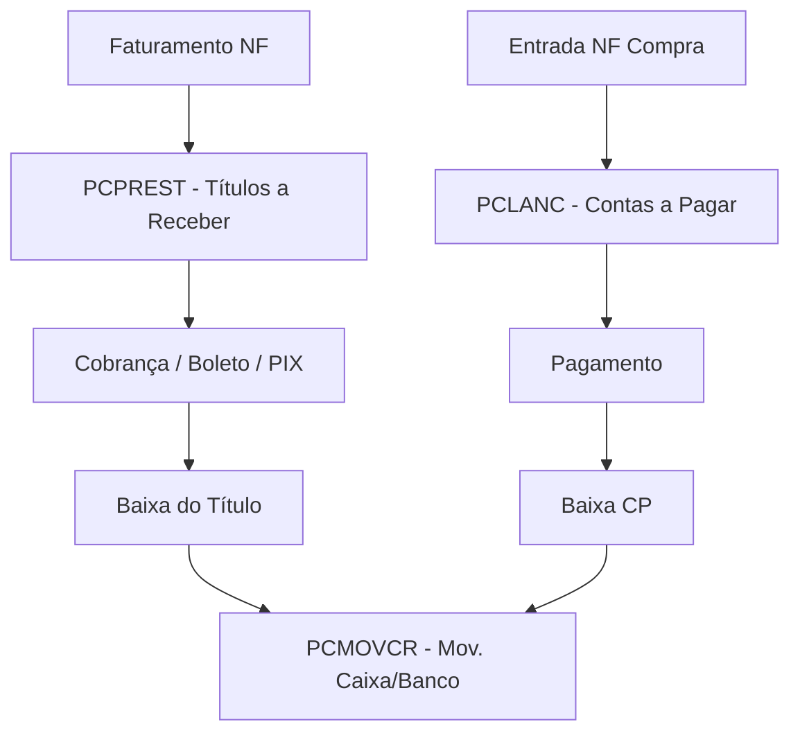

# TOTVS Winthor - Módulo Financeiro

## Visão Geral

Controla contas a receber, contas a pagar, caixa e bancos.

## Contas a Receber (PCPREST)

Títulos gerados automaticamente no faturamento pelo plano de pagamento.

**Campos-chave:** `NUMNOTA`, `PREST`, `CODCLI`, `CODCOB`, `DTVENC`, `VALOR`, `VLPAGO`, `VPAGO` (S/N), `DTPAGTO`, `CODBANCO`

**Tipos de cobrança (CODCOB):** `BK`=Boleto, `CH`=Cheque, `DI`=Dinheiro, `CD`=Cartão Débito, `CC`=Cartão Crédito, `DP`=Depósito, `TB`=Transferência, `PX`=PIX

| Rotina | Descrição |
|:---|:---|
| **501** | Consultar contas a receber |
| **502** | Baixar títulos |
| **505** | Gerar boletos |
| **510** | Retorno bancário |
| **523** | Renegociação de títulos |

### Aging de Recebíveis
```sql
SELECT 
    CASE 
        WHEN DTVENC >= TRUNC(SYSDATE) THEN 'A Vencer'
        WHEN TRUNC(SYSDATE) - DTVENC BETWEEN 1 AND 30 THEN '1-30 dias'
        WHEN TRUNC(SYSDATE) - DTVENC BETWEEN 31 AND 60 THEN '31-60 dias'
        ELSE 'Acima 60 dias'
    END AS FAIXA,
    COUNT(*) AS QTD, SUM(VALOR - NVL(VLPAGO,0)) AS SALDO
FROM PCPREST
WHERE NVL(VPAGO,'N') = 'N' AND VALOR - NVL(VLPAGO,0) > 0
GROUP BY CASE 
    WHEN DTVENC >= TRUNC(SYSDATE) THEN 'A Vencer'
    WHEN TRUNC(SYSDATE) - DTVENC BETWEEN 1 AND 30 THEN '1-30 dias'
    WHEN TRUNC(SYSDATE) - DTVENC BETWEEN 31 AND 60 THEN '31-60 dias'
    ELSE 'Acima 60 dias' END;
```

---

## Contas a Pagar (PCLANC)

Gerados na entrada de NF de compra ou manualmente.

**Campos-chave:** `NUMTRANSACAO`, `CODFORNEC`, `NUMNOTA`, `DTVENC`, `VALOR`, `DTPAGTO`, `CODFILIAL`

| Rotina | Descrição |
|:---|:---|
| **740** | Consultar contas a pagar |
| **741** | Incluir lançamento manual |
| **742** | Baixar contas a pagar |
| **749** | Pagamento em lote |

### Compromissos da Semana
```sql
SELECT l.NUMTRANSACAO, f.FORNECEDOR, l.DTVENC, l.VALOR
FROM PCLANC l
JOIN PCFORNEC f ON l.CODFORNEC = f.CODFORNEC
WHERE l.DTPAGTO IS NULL
  AND l.DTVENC BETWEEN TRUNC(SYSDATE) AND TRUNC(SYSDATE) + 7
ORDER BY l.DTVENC;
```

---

## Caixa e Bancos

**PCBANCO**: Cadastro de contas — `CODBANCO`, `BANCO`, `AGENCIA`, `NUMCONTACORRENTE`, `TIPOBANCO` (C=Caixa, B=Banco)

**PCMOVCR**: Movimentações — `CODBANCO`, `VALOR`, `DTMOV`, `TIPO` (D=Débito, C=Crédito)

### Saldo por Banco
```sql
SELECT b.BANCO,
    SUM(CASE WHEN m.TIPO='C' THEN m.VALOR ELSE -m.VALOR END) AS SALDO
FROM PCMOVCR m
JOIN PCBANCO b ON m.CODBANCO = b.CODBANCO
WHERE m.DTMOV >= TRUNC(SYSDATE,'MM')
GROUP BY b.BANCO;
```

---

## Fluxo de Caixa Projetado
```sql
SELECT 'RECEBER' AS TIPO, DTVENC AS DATA, SUM(VALOR-NVL(VLPAGO,0)) AS VALOR
FROM PCPREST WHERE NVL(VPAGO,'N')='N' AND DTVENC BETWEEN TRUNC(SYSDATE) AND TRUNC(SYSDATE)+30
GROUP BY DTVENC
UNION ALL
SELECT 'PAGAR', DTVENC, SUM(VALOR)*-1
FROM PCLANC WHERE DTPAGTO IS NULL AND DTVENC BETWEEN TRUNC(SYSDATE) AND TRUNC(SYSDATE)+30
GROUP BY DTVENC
ORDER BY 2;
```

## Fluxo Geral


