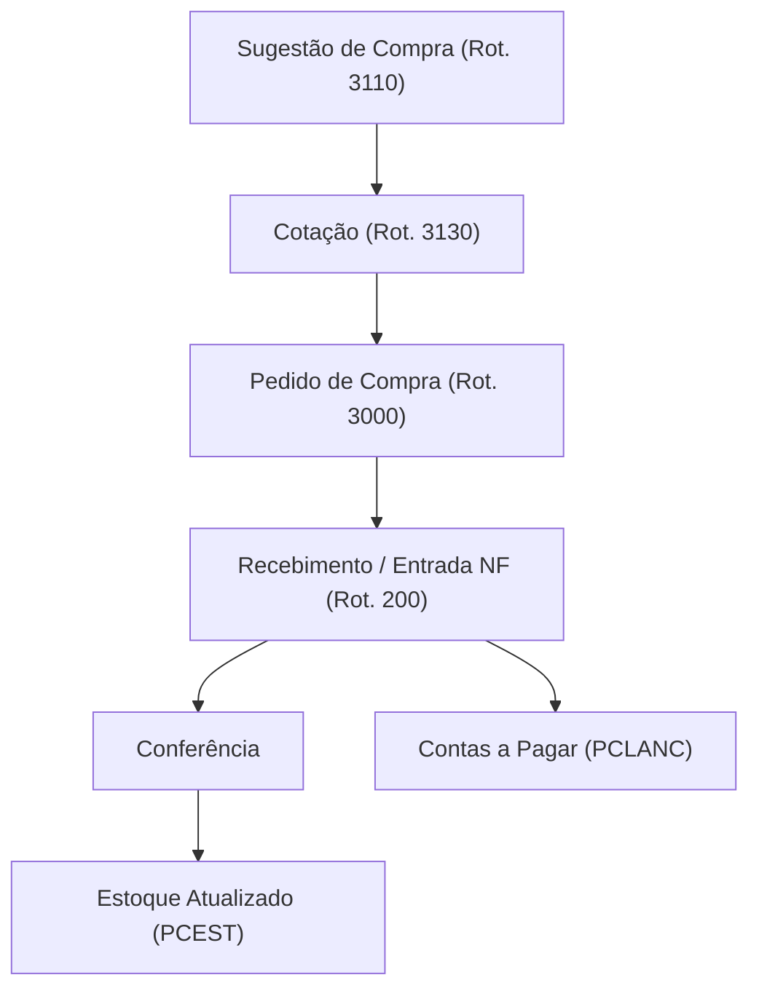

# TOTVS Winthor - Estoque e Compras

## Estoque

### Tabelas Principais

| Tabela | Descrição |
|:---|:---|
| `PCEST` | Saldo de estoque por filial |
| `PCPRODFILIAL` | Dados do produto por filial (custo, giro) |
| `PCMOV` | Movimentação de produtos (entrada/saída) |
| `PCPRODUT` | Cadastro de produtos |

### Campos do Estoque (PCEST)

| Campo | Descrição |
|:---|:---|
| `CODPROD` | Código do produto |
| `CODFILIAL` | Filial |
| `QTESTGER` | Quantidade em estoque gerencial |
| `QTRESERV` | Quantidade reservada (pedidos) |
| `QTBLOQUEADA` | Quantidade bloqueada (avaria, etc.) |
| `QTPENDENTE` | Quantidade pendente de entrada |
| `CUSTOULTENT` | Custo da última entrada |
| `CUSTOMED` | Custo médio |
| `DTULTENT` | Data última entrada |
| `DTULTSAIDA` | Data última saída |

### Fórmula de Disponibilidade
```
DISPONÍVEL = QTESTGER - QTRESERV - QTBLOQUEADA
```

### Consultas

#### Estoque Disponível
```sql
SELECT e.CODPROD, p.DESCRICAO, e.CODFILIAL,
    e.QTESTGER AS TOTAL,
    e.QTRESERV AS RESERVADO,
    e.QTBLOQUEADA AS BLOQUEADO,
    e.QTESTGER - NVL(e.QTRESERV,0) - NVL(e.QTBLOQUEADA,0) AS DISPONIVEL,
    e.CUSTOMED
FROM PCEST e
JOIN PCPRODUT p ON e.CODPROD = p.CODPROD
WHERE e.QTESTGER > 0
ORDER BY p.DESCRICAO;
```

#### Produtos com Estoque Crítico (abaixo do mínimo)
```sql
SELECT e.CODPROD, p.DESCRICAO,
    e.QTESTGER AS ESTOQUE,
    pf.QTESTMIN AS MINIMO,
    pf.QTESTMAX AS MAXIMO
FROM PCEST e
JOIN PCPRODUT p ON e.CODPROD = p.CODPROD
JOIN PCPRODFILIAL pf ON e.CODPROD = pf.CODPROD AND e.CODFILIAL = pf.CODFILIAL
WHERE e.QTESTGER < NVL(pf.QTESTMIN, 0)
  AND NVL(pf.QTESTMIN, 0) > 0
ORDER BY e.QTESTGER;
```

#### Curva ABC de Estoque (valor)
```sql
SELECT CODPROD, DESCRICAO, VL_ESTOQUE,
    SUM(VL_ESTOQUE) OVER (ORDER BY VL_ESTOQUE DESC) / SUM(VL_ESTOQUE) OVER () * 100 AS PERC_ACUM
FROM (
    SELECT e.CODPROD, p.DESCRICAO,
        e.QTESTGER * e.CUSTOMED AS VL_ESTOQUE
    FROM PCEST e
    JOIN PCPRODUT p ON e.CODPROD = p.CODPROD
    WHERE e.QTESTGER > 0 AND e.CUSTOMED > 0
)
ORDER BY VL_ESTOQUE DESC;
```

### Rotinas de Estoque

| Rotina | Descrição |
|:---|:---|
| **200** | Entrada de mercadorias |
| **210** | Consultar estoque |
| **213** | Inventário |
| **217** | Transferência entre filiais |
| **228** | Ajuste de estoque |
| **1105** | Consulta de movimentação |

---

## Compras

### Tabelas Principais

| Tabela | Descrição |
|:---|:---|
| `PCPEDIDO` | Pedido de compra (cabeçalho) |
| `PCITEM` | Itens do pedido de compra |
| `PCNFENT` | Nota fiscal de entrada (cabeçalho) |
| `PCMOV` | Movimentação (registra entradas) |
| `PCFORNEC` | Fornecedores |
| `PCCOTACAO` | Cotações |

### Fluxo de Compras



### Rotinas de Compras

| Rotina | Descrição |
|:---|:---|
| **3000** | Digitar pedido de compra |
| **3001** | Alterar pedido de compra |
| **3110** | Sugestão de compra |
| **3130** | Cotação de preços |
| **200** | Entrada de mercadorias |
| **201** | Devolução a fornecedor |

### Consulta: Pedidos de Compra em Aberto
```sql
SELECT 
    pc.NUMPED, pc.DTPEDIDO, f.FORNECEDOR,
    pi.CODPROD, p.DESCRICAO,
    pi.QTPEDIDA, pi.QTENTREGUE,
    pi.QTPEDIDA - NVL(pi.QTENTREGUE, 0) AS QT_PENDENTE
FROM PCPEDIDO pc
JOIN PCITEM pi ON pc.NUMPED = pi.NUMPED
JOIN PCFORNEC f ON pc.CODFORNEC = f.CODFORNEC
JOIN PCPRODUT p ON pi.CODPROD = p.CODPROD
WHERE pi.QTPEDIDA - NVL(pi.QTENTREGUE, 0) > 0
ORDER BY pc.DTPEDIDO;
```

> [!TIP]
> A rotina **3110** (Sugestão de Compra) analisa giro médio, estoque mínimo e lead time do fornecedor para sugerir automaticamente o que comprar e em qual quantidade.
